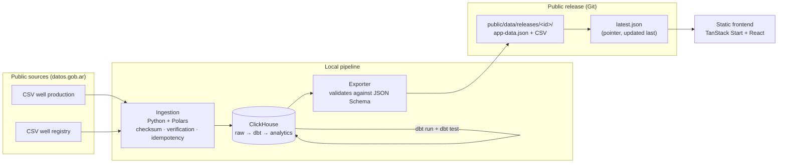

<!-- markdownlint-disable MD033 -->

# Pulso Vaca Muerta

*[Versión en español](README.md)*

**An open observatory of Argentine oil & gas production**, with an editorial focus on Vaca Muerta. A complete data pipeline — provenance-tracked ingestion, ClickHouse, dbt, tests, versioned static releases — serving a public frontend that never queries a production database.

This repo is my portfolio project as a **Data Engineer**: it's not a mockup with made-up data, it's a real pipeline running over ~18M rows of public production data from Argentina's Secretaría de Energía.

## The problem it solves

Argentina publishes valuable open data on oil and gas production, but using it seriously means clearing a lot of friction before you get to a single trustworthy chart: finding the right resources across catalogs and yearly CSVs, detecting retroactive revisions to files already loaded, normalizing operator names that change with corporate restructuring, telling a closed month apart from a partial one, and not turning a data-quality problem into a number published as if it were a fact. This project does that work once, in a reproducible and auditable way, and publishes the result.

Full functional scope, audiences, and acceptance criteria → [`docs/PRD.md`](docs/PRD.md) *(Spanish only)*.

## How it works (architecture at a glance)



There is no public backend, no managed database, no real-time queries: the browser does two `fetch()` calls against static files, and that's the entire runtime complexity. All the heavy computation (aggregations, joins, quality tests) has already run beforehand, in the local pipeline. Full cycle detail → [`docs/actualizacion-datos.en.md`](docs/actualizacion-datos.en.md).

## Stack

| Layer | Technology | Why |
|---|---|---|
| Ingestion | Python 3.12, Polars, `uv` | Schema verification, checksums, idempotent raw loading |
| Warehouse | ClickHouse (Docker) | Columnar, aggregates 18M+ rows in seconds, `ReplacingMergeTree` for idempotent reprocessing |
| Transformation | dbt Core + `dbt-clickhouse` | Versioned, tested SQL with lineage — staging → core → marts |
| Contracts | JSON Schema + `ajv` (frontend) + `jsonschema` (exporter) | The exporter can't publish a payload that fails the contract |
| Frontend | TanStack Start, React, Recharts, MapLibre, Tailwind/shadcn | SSR + client-only data fetching; no data server of its own |
| Infra | Docker Compose (ClickHouse only) | The only component with persistent state — see [`docs/docker.en.md`](docs/docker.en.md) |

## Repo structure

```text
pipeline/          # Ingestion (Python/uv): catalog, ingest, ddl, export, shape
dbt/               # Transformation: staging → core → marts, seeds, tests, macros
contracts/         # JSON Schema — source of truth for the pipeline↔frontend contract
docker-compose.yml # ClickHouse (the only containerized service today)
Makefile           # up · ingest · dbt · dbt-test · export · release
public/data/       # Releases versioned in Git: app-data.json + latest.json
src/               # Frontend: TanStack Router routes, components, data-client
docs/              # All documentation (see below)
```

## Running it locally

```bash
git clone https://github.com/darioabadie/petro-vision-showcase.git
cd petro-vision-showcase

# Data pipeline
make up              # start ClickHouse (Docker)
make ingest          # download and load S01 (production) to raw
make dbt             # staging → core → marts
make dbt-test        # blocking tests
make export          # generate public/data/releases/<id>/app-data.json + latest.json

# Frontend
bun install
bun dev              # http://localhost:3000, serving the release generated above
```

`make release` runs ingestion + dbt + tests + export in a single step. See [`docs/actualizacion-datos.en.md`](docs/actualizacion-datos.en.md) for the full cycle and what happens when a step fails.

## Project status

Pipeline operational with real data: ingestion of well production (S01) and well registry (S02), ~18.2M raw rows, dbt models with all tests green, real quality checks running against ClickHouse, map populated from the well registry. Pending (documented, not hidden): join coverage on `/calidad`, fractures/trajectories (S03/S04), cohorts and completions.

Detailed, component-by-component status table → [`docs/README.md`](docs/README.md) *(Spanish only)*.

## Documentation

Most of the documentation is in Spanish, matching the product's audience and source data. The core technical guides below are also available in English.

| Document | Content |
|---|---|
| [`docs/README.md`](docs/README.md) | Detailed project status and next steps *(ES)* |
| [`docs/PRD.md`](docs/PRD.md) | What's being built, for whom, and why *(ES)* |
| [`docs/architecture.md`](docs/architecture.md) / [`en`](docs/architecture.en.md) | Pipeline↔frontend design, contracts, releases and publishing |
| [`docs/MODELO_DE_DATOS.md`](docs/MODELO_DE_DATOS.md) | Source catalog, dimensional model, quality tests *(ES)* |
| [`docs/dbt.md`](docs/dbt.md) / [`en`](docs/dbt.en.md) | How the pipeline is modeled and tested in dbt |
| [`docs/clickhouse.md`](docs/clickhouse.md) / [`en`](docs/clickhouse.en.md) | Databases, table engines, and how to explore the data by hand |
| [`docs/docker.md`](docs/docker.md) / [`en`](docs/docker.en.md) | What's containerized today, what isn't, and why |
| [`docs/actualizacion-datos.md`](docs/actualizacion-datos.md) / [`en`](docs/actualizacion-datos.en.md) | Full release cycle, from source to frontend |
| [`docs/lovable.md`](docs/lovable.md) | JSON contract consumed by the frontend, routes and visual criteria *(ES)* |

## Data and license

Source: Secretaría de Energía de la Nación (Argentina), via [datos.gob.ar](https://datos.gob.ar/dataset/produccion-de-petroleo-y-gas-por-pozo) — CC BY 4.0, attribution required. This project doesn't replace official balances; it exposes the same sworn declarations with full traceability down to the source file and checksum.
