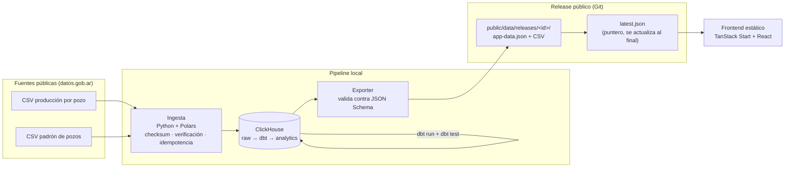

<!-- markdownlint-disable MD033 -->

# Pulso Vaca Muerta

*[English version](README.en.md)*

**Observatorio abierto de producción de hidrocarburos argentinos**, con foco editorial en Vaca Muerta. Pipeline de datos completo — ingesta con procedencia, ClickHouse, dbt, tests, releases estáticos versionados — sirviendo un frontend público que nunca consulta una base de datos en producción.

Este repo es mi proyecto de portfolio como **Data Engineer**: no es una maqueta con datos inventados, es un pipeline real corriendo sobre ~18M filas de datos públicos de la Secretaría de Energía de Argentina.

## El problema que resuelve

Argentina publica datos abiertos y valiosos de producción de petróleo y gas, pero usarlos en serio requiere resolver un montón de fricción antes de llegar a un solo gráfico confiable: encontrar los recursos correctos entre catálogos y CSV anuales, detectar revisiones retroactivas de archivos que ya se cargaron, normalizar nombres de operadores que cambian de razón social, distinguir un mes cerrado de uno parcial, y no convertir un problema de calidad de datos en un número públicado como si fuera un hecho. Este proyecto hace ese trabajo una vez, de forma reproducible y auditable, y publica el resultado.

Alcance funcional completo, audiencias y criterios de aceptación → [`docs/PRD.md`](docs/PRD.md).

## Cómo funciona (arquitectura en una imagen)



No hay backend público, ni base de datos gestionada, ni consultas en tiempo real: el navegador hace dos `fetch()` contra archivos estáticos y ahí termina toda la complejidad de runtime. Todo el cómputo pesado (agregaciones, joins, tests de calidad) ya corrió antes, en el pipeline local. Detalle completo del ciclo → [`docs/actualizacion-datos.md`](docs/actualizacion-datos.md).

## Stack

| Capa | Tecnología | Por qué |
|---|---|---|
| Ingesta | Python 3.12, Polars, `uv` | Verificación de esquema, checksums, carga idempotente a raw |
| Warehouse | ClickHouse (Docker) | Columnar, agrega 18M+ filas en segundos, motor `ReplacingMergeTree` para reprocesos idempotentes |
| Transformación | dbt Core + `dbt-clickhouse` | SQL versionado, testeado, con lineage — staging → core → marts |
| Contratos | JSON Schema + `ajv` (frontend) + `jsonschema` (exporter) | El exporter no puede publicar un payload que no cumple el contrato |
| Frontend | TanStack Start, React, Recharts, MapLibre, Tailwind/shadcn | SSR + solo-cliente para datos; sin servidor de datos propio |
| Infra | Docker Compose (solo ClickHouse) | Único componente con estado persistente — ver [`docs/docker.md`](docs/docker.md) |

## Estructura del repo

```text
pipeline/          # Ingesta (Python/uv): catalog, ingest, ddl, export, shape
dbt/               # Transformación: staging → core → marts, seeds, tests, macros
contracts/         # JSON Schema — fuente de verdad del contrato pipeline↔frontend
docker-compose.yml # ClickHouse (único servicio containerizado hoy)
Makefile           # up · ingest · dbt · dbt-test · export · release
public/data/       # Releases versionados en Git: app-data.json + latest.json
src/               # Frontend: rutas TanStack Router, componentes, data-client
docs/              # Toda la documentación (ver abajo)
```

## Puesta en marcha local

```bash
git clone https://github.com/darioabadie/petro-vision-showcase.git
cd petro-vision-showcase

# Pipeline de datos
make up              # levanta ClickHouse (Docker)
make ingest          # descarga y carga S01 (producción) a raw
make dbt             # staging → core → marts
make dbt-test        # tests bloqueantes
make export          # genera public/data/releases/<id>/app-data.json + latest.json

# Frontend
bun install
bun dev              # http://localhost:3000, sirviendo la release generada arriba
```

`make release` corre ingesta + dbt + tests + export en un solo paso. Ver [`docs/actualizacion-datos.md`](docs/actualizacion-datos.md) para el ciclo completo y qué pasa si un paso falla.

## Estado del proyecto

Pipeline operativo con datos reales: ingesta de producción por pozo (S01) y padrón de pozos (S02), ~18.2M filas raw, modelos dbt con tests todos en verde, quality checks reales corriendo contra ClickHouse, mapa poblado desde el padrón. Pendiente (documentado, no escondido): cobertura de join en `/calidad`, fracturas/trayectorias (S03/S04), cohortes y completaciones.

Tabla de estado detallada, componente por componente → [`docs/README.md`](docs/README.md).

## Documentación

| Documento | Contenido |
|---|---|
| [`docs/README.md`](docs/README.md) | Estado detallado del proyecto y próximos pasos |
| [`docs/PRD.md`](docs/PRD.md) | Qué se construye, para quién y por qué |
| [`docs/architecture.md`](docs/architecture.md) | Diseño pipeline↔frontend, contratos, releases y publicación |
| [`docs/MODELO_DE_DATOS.md`](docs/MODELO_DE_DATOS.md) | Catálogo de fuentes, modelo dimensional, tests de calidad |
| [`docs/dbt.md`](docs/dbt.md) | Cómo está modelado y testeado el pipeline en dbt |
| [`docs/clickhouse.md`](docs/clickhouse.md) | Bases, motores de tabla y cómo explorar los datos a mano |
| [`docs/docker.md`](docs/docker.md) | Qué está containerizado hoy, qué no, y por qué |
| [`docs/actualizacion-datos.md`](docs/actualizacion-datos.md) | Ciclo completo de un release, de la fuente al frontend |
| [`docs/lovable.md`](docs/lovable.md) | Contrato JSON consumido por el frontend, rutas y criterios visuales |

## Datos y licencia

Fuente: Secretaría de Energía de la Nación (Argentina), vía [datos.gob.ar](https://datos.gob.ar/dataset/produccion-de-petroleo-y-gas-por-pozo) — CC BY 4.0, atribución obligatoria. Este proyecto no reemplaza los balances oficiales; expone las mismas declaraciones juradas con trazabilidad completa hasta el archivo y checksum de origen.
