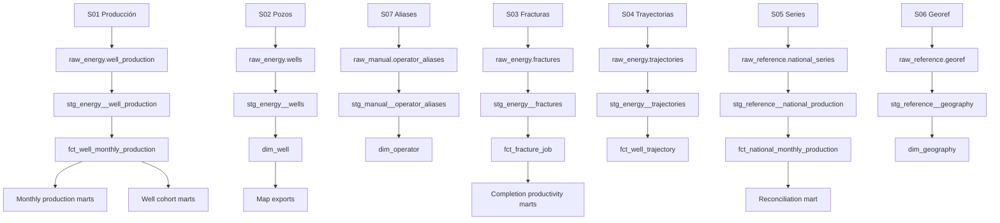

# Modelo de datos y catálogo de fuentes — Pulso Vaca Muerta

**Versión:** 0.1  
**Fecha de relevamiento:** 27 de agosto de 2026  
**Alcance:** Fuentes y modelo lógico/físico propuesto para el MVP.

## 1. Decisiones principales

- ClickHouse OSS será el motor analítico.
- dbt Core y `dbt-clickhouse` administrarán staging, core, marts, tests y documentación.
- Los archivos raw serán inmutables y se identificarán mediante SHA-256.
- La clave de integración de pozos será `idpozo`; `sigla` será una clave de auditoría y fallback.
- El período canónico será el primer día del mes, tipo `Date`.
- Las unidades oficiales se conservarán en core: petróleo y agua en m³; gas en miles de m³.
- Las revisiones de archivos no sobrescribirán la evidencia raw.
- Los agregados públicos se exportarán desde marts; los archivos completos no se incluirán en Git.
- La etiqueta “Vaca Muerta” se derivará inicialmente de la formación productiva normalizada y deberá documentar su cobertura.

## 2. Fuentes incluidas en el MVP

| ID | Fuente | Acceso | Grano | Cadencia | Licencia |
|---|---|---|---|---|---|
| S01 | Producción de petróleo y gas por pozo | CSV por año | Pozo-formación y mes | Mensual con revisiones | CC BY 4.0 |
| S02 | Padrón Capítulo IV de pozos | CSV | Pozo-formación | Variable/mensual | CC BY 4.0 |
| S03 | Fracturas de pozos, Adjunto IV | CSV | Registro de fractura | Declarada diaria | CC BY 4.0 |
| S04 | Trayectorias de pozos Vaca Muerta | CSV | Trayectoria/ramificación | Variable | CC BY 4.0 |
| S05 | Series nacionales de petróleo y gas | API JSON/CSV | Serie y mes | Mensual | Según catálogo; atribución obligatoria |
| S06 | Georef Argentina | API JSON | Coordenada consultada | Bajo demanda | CC BY 4.0 |
| S07 | Aliases de operadores | CSV interno | Nombre raw | Manual | Derivado; versionado en Git |

Los metadatos de S01–S04 se consultaron en la API CKAN de Datos Argentina. Los timestamps que siguen corresponden al catálogo al momento del relevamiento, no a una garantía de completitud del contenido.

## 3. Muestras descargadas

Las muestras están en [`data/samples`](../data/samples/). El archivo [`manifest.json`](../data/samples/manifest.json) registra URL, fecha declarada del recurso, cantidad de filas del archivo descargado, tamaño, checksum del original y checksum de la muestra.

| Fuente | Archivo completo relevado | Filas completas | Muestra incluida |
|---|---:|---:|---:|
| S01 Producción 2026 | 186.092.370 bytes | 573.180 | 120 filas |
| S02 Pozos | 34.133.626 bytes | 85.611 | 100 filas |
| S03 Fracturas | 1.217.832 bytes | 4.863 | 100 filas |
| S04 Trayectorias | 40.488.043 bytes | 2.340 | 12 filas |
| S05 Series nacionales | Consulta de 24 períodos | 24 | 24 filas |
| S06 Georef | Una consulta de ejemplo | 1 | Respuesta completa |
| S07 Aliases | Derivada de 70 nombres de operador observados | 30 | 30 filas pendientes de revisión |

La muestra de producción 2026 cubre enero–julio. El histórico completo tiene recursos anuales publicados desde 2006 hasta 2026; solo se descargó el archivo 2026 para perfilar el esquema y generar la muestra.

## 4. Fuente S01 — Producción mensual por pozo

### Identidad y acceso

- **Publicador:** Secretaría de Energía, Ministerio de Economía.
- **Catálogo:** [Producción de petróleo y gas por pozo (Capítulo IV)](https://datos.gob.ar/dataset/produccion-de-petroleo-y-gas-por-pozo).
- **Recurso relevado:** Producción de Pozos de Gas y Petróleo – 2026.
- **Última modificación declarada:** 2026-08-25 10:01:34 UTC aproximado.
- **Formato:** CSV UTF-8 con BOM, separado por comas.
- **Muestra:** [`01_well_production_2026_sample.csv`](../data/samples/01_well_production_2026_sample.csv).

### Grano y clave

El archivo 2026 observado contiene una fila por `idpozo`, año y mes. `idpozo` identifica el pozo por formación productiva, por lo que no debe interpretarse automáticamente como identidad física única de la boca del pozo.

Clave natural inicial:

```text
(idpozo, anio, mes)
```

En las 573.180 filas relevadas no se encontraron duplicados para esa clave. La restricción se validará nuevamente para cada recurso anual y para las variantes de DDJJ abiertas/cerradas antes de combinar archivos.

### Campos

| Grupo | Campos raw | Uso canónico |
|---|---|---|
| Identidad | `idpozo`, `sigla`, `idempresa`, `empresa` | Claves de pozo y operador informado en el período. |
| Período | `anio`, `mes`, `fecha_data` | `period`, fecha de corte y detección de parcialidad. |
| Producción | `prod_pet`, `prod_gas`, `prod_agua` | Petróleo m³, gas miles de m³, agua m³. |
| Inyección | `iny_agua`, `iny_gas`, `iny_co2`, `iny_otro` | Medidas de inyección; unidad a confirmar campo por campo en documentación oficial. |
| Operación | `tef`, `vida_util`, `tipoextraccion`, `tipoestado`, `tipopozo` | Estado y comportamiento operativo. |
| Reservorio | `formprod`, `formacion`, `tipo_de_recurso`, `sub_tipo_recurso`, `proyecto` | Clasificación convencional/no convencional y formación. |
| Geografía técnica | IDs y nombres de área, yacimiento, cuenca y provincia | Dimensiones de navegación. |
| Administración | `observaciones`, `fechaingreso`, `rectificado`, `habilitado`, `idusuario` | Auditoría; `idusuario` no se publicará en la capa analítica. |
| Clasificación | `clasificacion`, `subclasificacion` | Exploración, explotación y categorías informadas. |

### Perfil observado

- 573.180 filas y 38 columnas.
- 83.358 `idpozo` distintos.
- 70 nombres de empresa.
- 535.967 filas convencionales; 34.386 no convencionales; 2.799 sin reservorio; 28 no discriminadas.
- 159 pozos presentes en producción 2026 no aparecen en el padrón S02 descargado.
- Los campos críticos `idpozo`, empresa, período y volúmenes no presentaron vacíos en el perfil inicial.

### Ingesta

1. Consultar `package_show` para descubrir recursos y `last_modified`.
2. Descargar cada CSV anual a una ruta inmutable.
3. Calcular SHA-256 y registrar headers, tamaño y cantidad de filas.
4. Rechazar respuestas HTML, archivos vacíos o cambios de esquema no aprobados.
5. Cargar cada fila con metadata técnica.

### Riesgos y controles

- **Revisiones retroactivas:** comparar checksum aunque el nombre del recurso no cambie.
- **Mes parcial:** determinar completitud mediante período máximo, fecha de modificación y cobertura de operadores/pozos; no asumir que la existencia del mes implica cierre.
- **Filas sin movimiento:** conservarlas en raw, pero definir por separado “pozo reportado” y “pozo productivo”.
- **Unidades:** nunca convertir gas como si estuviera expresado en m³ simples.
- **Campos administrativos:** excluir `idusuario` de exports públicos.

## 5. Fuente S02 — Padrón de pozos

### Identidad y acceso

- **Catálogo:** el mismo dataset Capítulo IV de S01.
- **Recurso:** Capítulo IV - Pozos.
- **Última modificación declarada:** 2026-07-08 16:48:15.
- **Formato:** CSV UTF-8 con BOM.
- **Muestra:** [`02_wells_sample.csv`](../data/samples/02_wells_sample.csv).

### Grano y clave

Una fila por `idpozo`. En las 85.611 filas observadas:

- `idpozo` fue único.
- No se encontraron geometrías GeoJSON vacías.
- Se observaron 79 nombres de empresa.

### Campos

| Grupo | Campos raw | Uso canónico |
|---|---|---|
| Identidad | `idpozo`, `sigla` | Clave del pozo-formación y etiqueta técnica. |
| Ubicación operativa | `area`, `cod_area`, `yacimiento`, `cod_yacimiento`, `cuenca`, `provincia` | Dimensiones de área, yacimiento, cuenca y provincia. |
| Operador | `empresa` | Operador actual o informado en el padrón; no reemplaza al operador histórico de S01. |
| Reservorio | `formacion`, `tipo_recurso`, `sub_tipo_recurso`, `gasplus` | Clasificación del recurso. |
| Pozo | `cota`, `profundidad`, `clasificacion`, `subclasificacion`, `tipopozo`, `tipoextraccion`, `tipoestado` | Atributos técnicos y estado actual. |
| Fechas | Inicio/fin de perforación e inicio/fin de terminación | Ciclo de construcción del pozo. |
| Geometría | `geojson`, `geom` | Punto WGS84 y representación WKB/EWKB. |

### Regla de historia

El padrón se tratará como estado actual. Para análisis histórico, el operador, área y clasificación del mes se tomarán de S01. No se reescribirá el pasado usando el operador actual de S02.

## 6. Fuente S03 — Fracturas de pozos

### Identidad y acceso

- **Catálogo:** [Datos de fractura de pozos de hidrocarburos (Adjunto IV)](https://datos.gob.ar/dataset/datos-de-fractura-de-pozos-adjunto-iv).
- **Última modificación declarada:** 2026-08-25 04:00:02.
- **Formato:** CSV UTF-8 con BOM.
- **Muestra:** [`03_fractures_sample.csv`](../data/samples/03_fractures_sample.csv).

### Grano y clave

Una fila por registro de fractura identificado por `id_base_fractura_adjiv`. Un mismo `idpozo` puede tener más de una fila.

- 4.863 filas.
- 4.619 pozos distintos.
- No se detectaron IDs de fractura duplicados.
- 4.573 de esos pozos aparecen en S02; 46 no cruzan.

### Campos

| Grupo | Campos raw | Uso canónico |
|---|---|---|
| Identidad | `id_base_fractura_adjiv`, `idpozo`, `sigla` | Clave del trabajo y relación con pozo. |
| Contexto | Cuenca, área, yacimiento, formación, tipo/subtipo de reservorio | Dimensiones del trabajo. |
| Diseño | `longitud_rama_horizontal_m`, `cantidad_fracturas`, `tipo_terminacion` | Geometría y cantidad de etapas. |
| Materiales | Arena nacional/importada, agua y CO₂ inyectados | Medidas de completación. |
| Operación | Presión máxima y potencia de equipos | Parámetros reportados. |
| Fechas | Inicio/fin, fecha de carga y campos año/mes derivados | Orden temporal y control de calidad. |
| Informante | `empresa_informante` | Entidad que reportó el dato. |

### Calidad observada

- 2.054 filas informan longitud horizontal igual a cero; no deben usarse en normalizaciones por metro.
- La fecha mínima de inicio observada es 2006-05-19.
- La fecha máxima observada es 2026-12-05, posterior a la extracción del 27 de agosto de 2026. Puede representar carga anticipada, error o semántica no documentada; se marcará `is_future_dated` y se excluirá de métricas realizadas hasta validación.

## 7. Fuente S04 — Trayectorias de pozos Vaca Muerta

### Identidad y acceso

- **Catálogo:** [Trayectorias de Pozo Vaca Muerta](https://datos.gob.ar/dataset/trayectoria-de-pozos).
- **Última modificación declarada:** 2026-08-01 05:00:08.
- **Formato:** CSV UTF-8 con BOM; geometrías de gran tamaño.
- **Muestra:** [`04_trajectories_sample.csv`](../data/samples/04_trajectories_sample.csv).

### Grano y clave

El recurso no expone un identificador único de trayectoria. Contiene 2.340 filas para 1.880 `idpo`; 78 pozos tienen más de una fila. Se generará:

```text
trajectory_id = hash(idpo, sigla, geojson, drilini, drilfin)
```

`idpo` se mapeará a `idpozo`.

### Campos

- Identidad: `sigla`, `idpo`.
- Profundidades: final total, vertical y sidetrack.
- Rama horizontal: longitud y unidad de navegación.
- Fechas: perforación y terminación.
- Tipo de pozo.
- Geometría: `geometria` y `geojson`.

Las geometrías raw se conservarán como texto. Para publicación se generará GeoJSON simplificado y particionado, sin enviar el WKB completo al navegador.

## 8. Fuente S05 — Series nacionales de control

### Identidad y acceso

- **API:** [API de Series de Tiempo de Datos Argentina](https://datosgobar.github.io/series-tiempo-ar-api/reference/api-reference/).
- **Consulta de muestra:** petróleo crudo y gas natural, últimos 24 períodos.
- **Muestra:** [`05_national_production_series_sample.csv`](../data/samples/05_national_production_series_sample.csv).

Series seleccionadas:

| ID | Descripción | Unidad declarada |
|---|---|---|
| `363.3_PRODUCCIONUDO__28` | Producción de petróleo crudo | Miles de m³ |
| `364.3_PRODUCCIoNRAL__25` | Producción de gas natural | Millones de m³ |

### Uso

Estas series no reemplazan al detalle de pozos. Se utilizarán para reconciliación mensual:

```text
oil_control = sum(prod_pet) / 1.000
gas_control = sum(prod_gas) / 1.000
```

La comparación solo se ejecutará donde ambas fuentes tengan datos. En la muestra de 24 meses, petróleo contiene seis valores vacíos mientras gas tiene cobertura completa; cada serie tendrá su propia fecha máxima válida.

## 9. Fuente S06 — Georef Argentina

### Identidad y acceso

- **API:** [Servicio de Normalización de Datos Geográficos](https://datosgobar.github.io/georef-ar-api/).
- **Endpoint:** `/ubicacion` para georreferenciación inversa.
- **Muestra:** [`06_georef_location_sample.json`](../data/samples/06_georef_location_sample.json).

### Grano

Una respuesta por par latitud/longitud consultado. Devuelve provincia, departamento y, cuando existe, municipio.

### Estrategia

- Extraer coordenadas únicas nuevas de S02.
- Consultar en lotes respetuosos de la API o preferir descargas geográficas completas para grandes volúmenes.
- Cachear por coordenada redondeada y versión de Georef.
- No bloquear la producción si el municipio es nulo.

La consulta de muestra corresponde a un pozo de Chubut y devuelve departamento Escalante sin municipio.

## 10. Fuente S07 — Aliases de operadores

### Identidad y acceso

- **Origen:** nombres distintos observados en `empresa`.
- **Administración:** seed CSV versionado y revisado mediante pull request.
- **Muestra inicial:** [`07_operator_aliases_seed.csv`](../data/samples/07_operator_aliases_seed.csv).

### Grano y esquema

| Campo | Descripción |
|---|---|
| `operator_raw` | Valor exacto de la fuente. |
| `operator_canonical` | Nombre canónico propuesto. |
| `review_status` | `pending_review` o `approved`. |
| `notes` | Justificación y fuente de la decisión. |

La muestra fue generada algorítmicamente y todas sus filas están pendientes de revisión; no debe usarse como verdad societaria. Una iteración posterior puede agregar vigencia y grupo económico.

## 11. Metadata técnica común

Todas las tablas raw incluirán:

| Campo | Tipo ClickHouse | Descripción |
|---|---|---|
| `_load_id` | UUID | Identificador de la ejecución. |
| `_source_url` | String | URL exacta descargada o consultada. |
| `_resource_id` | LowCardinality(String) | ID del recurso CKAN o identificador interno de API. |
| `_resource_last_modified` | Nullable(DateTime64) | Timestamp publicado en catálogo. |
| `_retrieved_at` | DateTime64 | Momento real de descarga. |
| `_source_sha256` | FixedString(64) | Checksum del archivo/respuesta. |
| `_row_number` | UInt64 | Posición en el archivo. |
| `_raw_payload` | String, opcional | Respuesta original para APIs pequeñas. |

## 12. Capas del modelo



## 13. Modelo core

### 13.1 Dimensiones

#### `dim_date_month`

Grano: un mes.

- `month_date`
- año, trimestre y mes.
- días del mes.
- flags de mes completo y último mes publicable.

#### `dim_operator`

Grano: operador canónico.

- `operator_sk`
- `operator_canonical`
- `operator_raw_values`
- estado de revisión.
- vigencia futura opcional.

#### `dim_well`

Grano: `idpozo`.

- Identidad y `sigla`.
- Atributos actuales del padrón.
- Coordenadas y claves geográficas.
- Fechas de perforación/terminación.
- Primera producción derivada.
- Flags de cobertura: fractura, trayectoria y Georef.

El operador histórico no se inferirá desde esta dimensión.

#### `dim_basin`, `dim_area`, `dim_field`, `dim_formation`, `dim_geography`

Dimensiones normalizadas para filtros y consistencia de etiquetas. Las claves canónicas se generarán desde códigos oficiales cuando existan; los nombres se usarán solo cuando no exista código.

### 13.2 Hechos

#### `fct_well_monthly_production`

Grano: un `idpozo` por mes, versión lógica vigente.

Claves:

- `month_date`
- `well_sk`
- `operator_sk`
- claves de cuenca, área, yacimiento, formación y geografía.

Medidas:

- `oil_m3`
- `gas_thousand_m3`
- `water_m3`
- inyecciones.
- `effective_time_factor`
- `useful_life`

Flags:

- producción positiva.
- convencional/no convencional.
- mes parcial.
- match con padrón.
- versión rectificada.

#### `fct_fracture_job`

Grano: `id_base_fractura_adjiv`.

- Pozo, fechas y contexto técnico.
- Longitud horizontal.
- Etapas.
- Arena, agua, CO₂, presión y potencia.
- Flags de validez y fecha futura.

#### `fct_well_trajectory`

Grano: trayectoria derivada.

- `trajectory_id`.
- Pozo.
- Profundidades y longitudes.
- Fechas.
- GeoJSON raw y versión simplificada/exportable.

#### `fct_national_monthly_production`

Grano: producto y mes.

- `product_code` = oil/gas.
- valor.
- unidad.
- ID de serie.
- freshness propia de la serie.

## 14. Marts

| Modelo | Grano | Propósito |
|---|---|---|
| `mart_argentina_monthly_production` | Mes y producto | Home, variación mensual/interanual y composición. |
| `mart_operator_monthly_rankings` | Mes, producto y operador | Ranking y contribución a la variación. |
| `mart_unconventional_share` | Mes y producto | Convencional/no convencional y subtipo. |
| `mart_well_cohort_curve` | Cohorte, segmento y edad en meses | Curvas y producción acumulada comparable. |
| `mart_completion_productivity` | Grupo de completación y ventana | Productividad por rama y etapa, con cobertura. |
| `mart_source_reconciliation` | Mes y producto | Diferencia Capítulo IV vs serie nacional. |
| `mart_data_quality_status` | Fuente, regla y ejecución | Página pública de calidad. |
| `mart_map_wells` | Pozo | Export geográfico liviano. |

## 15. Definición de cohortes

1. Encontrar el primer mes donde `oil_m3 > 0 OR gas_thousand_m3 > 0`.
2. Definir `well_age_month = dateDiff('month', first_production_month, month_date)`.
3. Excluir meses anteriores al inicio.
4. Conservar únicamente pozos con ventana completa para métricas N meses.
5. Publicar conteo de pozos, mediana, percentiles 25/75 y no solamente promedio.
6. No mostrar un segmento con menos de 10 pozos por defecto.

## 16. Definición inicial de Vaca Muerta

Para el MVP:

```text
is_vaca_muerta = normalized_formation = 'VACA MUERTA'
```

No se inferirá por provincia ni por “no convencional”: existen recursos no convencionales en otras formaciones y producción de Vaca Muerta que requiere revisar cómo fue declarada. El sitio mostrará por separado:

- Formación Vaca Muerta.
- Total no convencional.
- Cuenca Neuquina.

Una tabla manual futura podrá documentar aliases y excepciones de formación.

## 17. Diseño físico en ClickHouse

### Raw

Los raw usarán `MergeTree` y conservarán todas las versiones:

```text
PARTITION BY toYYYYMM(_retrieved_at)
ORDER BY (_resource_id, _source_sha256, _row_number)
```

### Producción core

```text
ENGINE = ReplacingMergeTree(_record_version)
PARTITION BY toYear(month_date)
ORDER BY (well_id, month_date)
```

`_record_version` derivará de `resource_last_modified` y `retrieved_at`. Los queries públicos usarán el modelo dbt vigente; raw seguirá permitiendo auditoría de revisiones.

### Tipos

- IDs numéricos de origen: conservar también su representación String si existe riesgo de códigos especiales.
- Categorías: `LowCardinality(String)`.
- Fechas: `Date` y `DateTime64(3)`.
- Volúmenes: `Decimal64` o `Float64` tras perfilar precisión y valores extremos.
- Booleanos fuente `t/f`: `Bool` en staging.
- Geometrías: String/GeoJSON raw; arrays o archivos GeoJSON derivados para consumo.

## 18. Estrategia incremental

1. Consultar metadata de catálogo.
2. Comparar resource ID, `last_modified` y checksum con el manifest anterior.
3. Si el checksum es nuevo, registrar una nueva versión en landing y raw.
4. Recalcular únicamente años/períodos afectados.
5. Ejecutar dimensiones antes que facts dependientes.
6. Ejecutar tests y reconciliaciones.
7. Promover marts solo si pasan los tests críticos.
8. Exportar agregados y publicar el sitio.

Un cambio de `last_modified` sin cambio de checksum se registra, pero no obliga a reprocesar. Un cambio de checksum siempre obliga a reprocesar aunque `last_modified` permanezca igual.

## 19. Tests

### Críticos — bloquean publicación

- Unicidad y no nulidad de `(well_id, month_date)` en producción core.
- Unicidad de `well_id` en `dim_well`.
- Unicidad de `fracture_job_id`.
- Valores de año/mes válidos.
- Archivos con headers esperados.
- Filas cargadas mayores a umbral histórico razonable.
- Ningún período público marcado como completo si falla la regla de cierre.
- Reconciliación dentro de tolerancia aprobada o excepción explícita.

### Advertencias

- Producción o inyección negativa.
- Fechas futuras.
- Pozos sin padrón.
- Longitud horizontal igual a cero.
- Aliases pendientes.
- Coordenadas fuera de Argentina o fuera de rangos válidos.
- Cambios bruscos en distribución de categorías.

### Perfil inicial que debe convertirse en tests

- 159 pozos de producción 2026 sin match con padrón.
- 46 pozos de fracturas sin match con padrón.
- 2 pozos de trayectorias sin match con padrón.
- 2.054 registros de fractura con longitud horizontal cero.
- Fechas de fractura posteriores a la fecha de extracción.
- Seis meses sin valor de petróleo en la consulta de control de 24 períodos.

## 20. Provenance y auditoría

Cada cifra pública debe poder reconstruirse así:

```text
gráfico → mart dbt → fact/dimension → staging → raw row
       → checksum → archivo/API → URL oficial
```

Los exports incluirán:

- `data_period`.
- `published_at`.
- `source_last_modified`.
- `pipeline_run_id`.
- enlace a metodología.

## 21. Archivos que no se versionarán

- CSV históricos completos.
- WKB/WKT completos.
- Bases ClickHouse.
- Artefactos temporales de descarga.
- Credenciales o tokens.

En Git se conservarán muestras, manifests, esquemas, tests, código y agregados explícitamente publicables.

## 22. Validaciones pendientes antes de implementar

1. Confirmar documentación oficial de unidades de todos los campos de inyección.
2. Medir duplicados de clave sobre todos los archivos 2006–2026.
3. Comparar recursos estándar contra variantes “DDJJ abiertas y cerradas” y elegir uno como fuente canónica.
4. Definir la regla objetiva de mes completo.
5. Medir si `idpozo` cambia cuando cambia la formación productiva de una misma boca.
6. Revisar fechas futuras de S03 con un especialista o documentación de Adjunto IV.
7. Aprobar manualmente aliases de operadores.
8. Validar la definición editorial de Vaca Muerta con alguien del dominio.
9. Establecer tolerancia de reconciliación por producto.
10. Confirmar cómo representar cambios históricos de operador y concesión.
