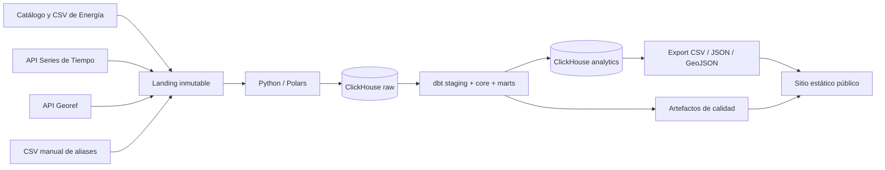

# PRD — Pulso Vaca Muerta

**Estado:** Borrador para validación  
**Versión:** 0.1  
**Fecha:** 27 de agosto de 2026  
**Nombre de trabajo:** Pulso Vaca Muerta  
**Tagline:** Datos abiertos sobre producción, pozos y productividad de los hidrocarburos argentinos.

## 1. Resumen ejecutivo

Pulso Vaca Muerta será un observatorio público, gratuito y reproducible que transforma datos abiertos de la Secretaría de Energía en indicadores comprensibles sobre la producción argentina de petróleo y gas, con foco editorial en Vaca Muerta y los recursos no convencionales.

El producto combinará un pipeline de datos open source —Python/Polars, ClickHouse y dbt Core— con un sitio público rápido y fácil de compartir. La propuesta de valor no es replicar planillas oficiales: es preservar su trazabilidad, resolver problemas de calidad y nomenclatura, relacionar producción con pozos y fracturas, y explicar qué cambió y por qué importa.

El proyecto cumplirá una doble función:

1. Producto de información útil para profesionales, periodistas, analistas y público interesado en energía.
2. Portfolio técnico verificable de Analytics Engineering y Data Engineering.

## 2. Problema

Argentina publica datos valiosos de producción y actividad upstream, pero su uso requiere:

- Encontrar recursos repartidos entre catálogos, APIs y archivos CSV.
- Descargar archivos grandes y susceptibles a revisiones retroactivas.
- Interpretar identificadores, unidades y categorías del dominio.
- Resolver nombres de operadores y entidades que cambian o no son consistentes.
- Relacionar producción, pozos, fracturas, trayectorias y geografía.
- Distinguir meses completos de períodos parciales.
- Detectar anomalías antes de convertir registros administrativos en indicadores públicos.

Las personas que no tienen capacidad técnica terminan dependiendo de informes cerrados o gráficos aislados. Quienes sí tienen capacidad técnica repiten buena parte del trabajo de preparación.

## 3. Visión

Convertirse en la referencia abierta y metodológicamente transparente para responder:

> ¿Qué está pasando con la producción y productividad de Vaca Muerta, qué operadores y áreas explican los cambios, y qué tan confiables son los datos disponibles?

## 4. Principios del producto

1. **Fuente antes que narrativa.** Todo indicador debe enlazar su fuente, definición y fecha de actualización.
2. **Reproducibilidad.** El código, las transformaciones y los tests serán públicos.
3. **Neutralidad.** El observatorio no promociona ni condena la actividad; explica datos y limitaciones.
4. **No confundir estimaciones con hechos.** Una aproximación debe rotularse como tal.
5. **Mostrar la calidad del dato.** Las inconsistencias relevantes serán parte del producto, no un detalle oculto.
6. **Compartible por diseño.** Cada vista importante tendrá URL estable, título explicativo y una imagen social reutilizable.
7. **MVP acotado.** Primero producción, pozos y fracturas. Precios, minería, pronósticos y análisis económico quedan fuera del primer release.

## 5. Objetivos

### 5.1 Objetivos de producto

- Publicar una vista mensual de la producción argentina con foco no convencional.
- Permitir comparar operadores, cuencas, provincias, áreas, yacimientos y formaciones.
- Mostrar evolución por cohortes de pozos y meses desde primera producción.
- Relacionar completación y productividad cuando la cobertura del cruce lo permita.
- Publicar un estado observable de frescura y calidad de cada fuente.
- Facilitar la descarga de agregados y la reutilización de gráficos.

### 5.2 Objetivos técnicos

- Ingerir archivos CSV grandes y APIs con trazabilidad y control de versiones.
- Modelar las transformaciones en dbt Core sobre ClickHouse.
- Implementar modelos incrementales, tests, documentación y lineage.
- Separar raw, staging, core y marts.
- Automatizar actualización, validación y publicación.
- Mantener un entorno local reproducible con Docker.

### 5.3 Objetivo de portfolio

Demostrar mediante código y artefactos públicos:

- Modelado dimensional.
- SQL y dbt.
- ClickHouse y diseño columnar.
- Python y procesamiento de archivos.
- Integración de APIs.
- Calidad de datos.
- CI/CD y observabilidad.
- Capacidad de traducir datos técnicos en un producto comprensible.

## 6. Fuera de alcance del MVP

- Predicción de producción o reservas.
- Valuación de empresas o recomendación de inversiones.
- Estimación de ingresos, regalías o rentabilidad por operador.
- Cálculo de EUR, NPV, IRR o break-even por pozo.
- Datos ambientales no respaldados por una fuente compatible y trazable.
- Noticias, opiniones o contenido generado automáticamente sin revisión.
- Datos de minería o litio.
- Autenticación, cuentas de usuario y dashboards personalizados.
- Hosting público de las tablas raw completas.

## 7. Audiencias

### 7.1 Profesional de energía

Necesita comparar producción y productividad por operador, área, formación o cohorte sin rehacer el procesamiento de los archivos públicos.

### 7.2 Periodista o analista económico

Necesita encontrar rápidamente una cifra reciente, entender su definición y descargar un gráfico o tabla con fuente verificable.

### 7.3 Persona interesada en energía

Necesita explicaciones claras sobre la diferencia entre producción convencional y no convencional, petróleo y gas, producción total y productividad por pozo.

### 7.4 Recruiter o hiring manager de datos

Necesita comprobar que el autor puede construir y documentar un pipeline moderno, no solamente diseñar un dashboard.

## 8. Jobs to be done

- Cuando se publica un nuevo mes, quiero saber qué cambió respecto del mes anterior y del mismo mes del año anterior.
- Cuando una empresa anuncia un récord, quiero contrastarlo con una serie pública y reproducible.
- Cuando comparo operadores, quiero usar las mismas unidades, períodos y reglas de inclusión.
- Cuando observo una cohorte de pozos, quiero comparar su producción según meses desde el inicio, sin mezclar antigüedades.
- Cuando un dato parece extraño, quiero saber si proviene de la fuente o de una transformación.
- Cuando reutilizo una cifra, quiero disponer de la metodología y URL exacta de la fuente.

## 9. Alcance funcional del MVP

### 9.1 Home / resumen mensual

Debe incluir:

- Último período completo disponible.
- Producción mensual de petróleo en m³ y barriles equivalentes de presentación.
- Producción mensual de gas en miles de m³.
- Variación mensual e interanual.
- Participación convencional/no convencional.
- Cantidad de pozos con producción positiva.
- Operadores que más explican la variación del mes.
- Estado de actualización y calidad.

### 9.2 Explorador de producción

Filtros:

- Período.
- Producto: petróleo, gas o agua.
- Tipo y subtipo de recurso.
- Operador.
- Provincia.
- Cuenca.
- Área/concesión.
- Yacimiento.
- Formación productiva.

Funciones:

- Serie temporal.
- Tabla descargable.
- Comparación de hasta cinco entidades.
- URL que preserve filtros.

### 9.3 Operadores

- Producción actual y evolución.
- Participación sobre el total.
- Distribución por área y recurso.
- Altas de pozos productivos por mes.
- Cohortes recientes.
- Nota visible sobre normalización de nombres y cambios societarios.

### 9.4 Pozos y cohortes

- Primera producción positiva.
- Meses desde primera producción.
- Producción acumulada a 3, 6 y 12 meses cuando exista cobertura.
- Curvas normalizadas por cohorte, operador, área y formación.
- Cantidad de observaciones detrás de cada curva.
- Prohibición de mostrar comparaciones con muestras demasiado pequeñas; umbral inicial: 10 pozos.

### 9.5 Fracturas y productividad

- Longitud de rama horizontal.
- Cantidad de etapas.
- Arena y agua informadas.
- Productividad normalizada por longitud y etapa, solamente cuando los campos necesarios sean válidos.
- Cobertura de cruce entre fractura y producción.
- Advertencia contra interpretaciones causales: una correlación no prueba que una configuración produzca el resultado observado.

### 9.6 Mapa

- Ubicación de pozos.
- Color por estado, operador o tipo de recurso.
- Vista opcional de trayectorias de Vaca Muerta.
- Agregación o clustering para evitar enviar decenas de miles de geometrías al navegador.

### 9.7 Calidad y metodología

- Fecha de última modificación de cada recurso.
- Fecha de última ingesta exitosa.
- Cantidad de filas procesadas.
- Checksums y revisiones detectadas.
- Pozos sin correspondencia con el padrón.
- Claves duplicadas.
- Fechas futuras o inválidas.
- Valores negativos o físicamente improbables.
- Cobertura de relaciones entre fuentes.
- Diferencia entre agregados por pozo y las series nacionales de control.

### 9.8 Descargas

El MVP publicará agregados derivados y muestras, no una copia completa de los archivos raw:

- CSV de producción mensual agregada.
- CSV de ranking mensual de operadores.
- CSV de cohortes.
- JSON/CSV con estado de calidad.
- Muestras versionables de las fuentes.

## 10. Definiciones iniciales de métricas

| Métrica | Definición inicial |
|---|---|
| Producción de petróleo | Suma de `prod_pet`, conservando m³ como unidad canónica. |
| Producción de gas | Suma de `prod_gas`; la fuente expresa miles de m³. |
| Producción de agua | Suma de `prod_agua`, en m³. |
| Pozo productivo | `prod_pet > 0 OR prod_gas > 0` en el mes. |
| Primera producción | Primer mes histórico con producción positiva de petróleo o gas. |
| Participación no convencional | Producción de filas clasificadas como `NO CONVENCIONAL` dividida por la producción clasificable total. |
| Variación mensual | Cambio respecto del mes completo inmediatamente anterior. |
| Variación interanual | Cambio respecto del mismo mes del año anterior. |
| Producción acumulada N meses | Suma desde el mes cero hasta N−1, únicamente para cohortes con ventana completa. |
| Productividad por etapa | Producción acumulada elegida dividida por etapas de fractura válidas y mayores a cero. |
| Cobertura de cruce | Pozos de la fuente secundaria encontrados en `dim_well` dividido por pozos distintos de esa fuente. |

Las conversiones a barriles serán de presentación. Los cálculos y reconciliaciones conservarán las unidades oficiales.

## 11. Requisitos de datos

- Cada registro raw debe incluir `_source_url`, `_resource_id`, `_resource_last_modified`, `_retrieved_at`, `_source_sha256` y `_load_id`.
- Las descargas deben ser inmutables y estar identificadas por checksum.
- Un cambio de checksum con el mismo nombre debe tratarse como una nueva versión.
- El pipeline debe tolerar revisiones históricas y reemplazar la versión lógica vigente sin perder auditoría raw.
- Los meses parciales deben identificarse y nunca compararse como si estuvieran completos.
- `idpozo` será la clave principal de integración; `sigla` se conservará como clave de auditoría y fallback, no como identidad principal.
- Los aliases de operadores deben estar versionados y tener estado `pending_review` o `approved`.

## 12. Requisitos no funcionales

### Rendimiento

- Home y páginas preagregadas: carga objetivo menor a 2 segundos en conexión de escritorio normal.
- Interacciones locales sobre agregados: respuesta objetivo menor a 500 ms.
- No consultar el fact raw desde el navegador.

### Reproducibilidad

- Inicio local mediante Docker Compose y comandos documentados.
- Versiones de dependencias fijadas.
- Sin credenciales en Git.
- Pipeline completo ejecutable desde archivos públicos.

### Calidad

- `dbt build` obligatorio antes de publicar.
- Cero claves primarias duplicadas en modelos core.
- Relaciones críticas con cobertura medida y umbral explícito.
- Reconciliación mensual contra series nacionales; las diferencias fuera de tolerancia deben bloquear publicación o generar una advertencia visible.

### Accesibilidad y comunicación

- Diseño responsive.
- Contraste WCAG AA como objetivo.
- Gráficos con descripción textual y tabla alternativa.
- Fechas y unidades visibles en todas las vistas.
- Español en el MVP; resumen y README en inglés en una iteración posterior.

### Privacidad y seguridad

- No se procesan datos personales.
- Validación de URLs y tipos de archivo.
- Límite de tamaño y timeout en descargas.
- Las APIs públicas no recibirán información del usuario.

## 13. Arquitectura de referencia

La base ClickHouse será open source y correrá en Docker/Linux. El frontend público consumirá agregados estáticos para evitar el costo y la exposición de un servidor analítico permanente.

## 14. Actualización

| Fuente | Cadencia declarada | Cadencia de ingesta propuesta |
|---|---:|---:|
| Producción por pozo | Mensual, con revisiones | Semanal; publicación cuando exista un nuevo período completo |
| Padrón de pozos | Variable/mensual | Semanal |
| Fracturas | Diaria | Semanal en el MVP |
| Trayectorias | Variable | Mensual |
| Series nacionales | Mensual | Semanal |
| Georef | Bajo demanda | Solo para coordenadas nuevas |
| Aliases manuales | Bajo demanda | Con cada cambio aprobado en Git |

## 15. Publicación y tracción

El observatorio debe producir un paquete editorial mensual:

- Una página permanente del período.
- Un resumen “cinco datos del mes”.
- Tres imágenes 1200×630 listas para LinkedIn/X.
- Un hilo corto en español.
- Una versión breve en inglés.
- Enlace a metodología y descarga.

Temas recurrentes:

- Récords y cambios mensuales.
- Convencional versus no convencional.
- Operadores que explican el crecimiento.
- Nuevas cohortes de pozos.
- Productividad por área o formación.
- Calidad y revisiones de los datos públicos.

## 16. Métricas de éxito propuestas

### Primeros 90 días desde el lanzamiento

- 1.000 visitantes únicos acumulados.
- 20 menciones, reposts o backlinks externos verificables.
- 50 estrellas en GitHub.
- 10 usuarios recurrentes del sector que visiten dos o más publicaciones.
- Al menos una cita en un medio, newsletter, comunidad o informe sectorial.

### Operación del pipeline

- Publicación dentro de las 72 horas posteriores a detectar un período completo nuevo.
- 100% de fuentes con provenance y checksum.
- Cero publicaciones con tests críticos fallidos.
- Más de 99% de los pozos mensuales vinculados al padrón, o excepción documentada.
- Historial de ejecuciones y revisiones visible.

Los objetivos de audiencia son hipótesis y se revisarán luego de los primeros tres meses.

## 17. Riesgos y mitigaciones

| Riesgo | Mitigación |
|---|---|
| El organismo corrige archivos históricos sin cambiar el nombre | Comparar checksum y `last_modified`; conservar versiones raw. |
| El mes más reciente está incompleto | Regla de cierre, banner de parcialidad y exclusión de comparaciones. |
| Cambios de nombres societarios distorsionan rankings | Tabla manual de aliases con revisión y vigencia. |
| Un pozo no cruza entre fuentes | Métrica de cobertura; quarantine; fallback auditado por `sigla`. |
| Fechas futuras o valores imposibles | Tests, quarantine y exclusión de métricas derivadas hasta validación. |
| El público interpreta correlación como causalidad | Texto metodológico y mínimos de muestra. |
| Geometrías demasiado pesadas para web | Simplificación y exportación por niveles de zoom. |
| Caída temporal de portales oficiales | Cache de la última versión válida; no reemplazar por archivos incompletos. |
| El proyecto se vuelve demasiado grande | Gate de alcance: minería, precios y forecasting quedan fuera del MVP. |

## 18. Fases

### Fase 0 — Fundaciones

- Repositorio y Docker Compose.
- Descarga reproducible y manifest de fuentes.
- ClickHouse raw.
- Proyecto dbt y CI.

### Fase 1 — MVP de producción

- Histórico completo por pozo.
- Padrón de pozos y aliases.
- Modelos core y cinco marts.
- Home, explorador, operadores y calidad.
- Publicación estática.

### Fase 2 — Pozos y completación

- Fracturas y trayectorias.
- Cohortes y curvas.
- Mapa.
- Productividad normalizada con cobertura explícita.

### Fase 3 — Distribución

- Automatización editorial.
- Inglés.
- SEO y tarjetas sociales.
- API o descargas ampliadas de agregados.

## 19. Criterios de aceptación del MVP

- El pipeline descarga y registra cada recurso sin intervención manual, excepto aliases.
- Puede reconstruirse desde cero en una máquina nueva siguiendo el README.
- El modelo mensual no contiene duplicados en `(well_id, period)`.
- Todos los registros core tienen provenance hasta archivo y checksum.
- El sitio muestra al menos 24 meses completos de producción.
- Se puede filtrar por operador, cuenca, provincia y tipo de recurso.
- Se publica un ranking mensual y una vista de participación no convencional.
- Existe una página de calidad con frescura, cobertura de joins y anomalías.
- Los agregados del último período completo se reconcilian contra la serie nacional dentro de una tolerancia aprobada o muestran una excepción documentada.
- Cada gráfico tiene unidad, período, fuente y enlace a metodología.
- Ningún dato del período parcial se presenta como cierre mensual.

## 20. Preguntas abiertas

1. ¿El foco editorial será exclusivamente Vaca Muerta o el sitio abrirá con Argentina y permitirá filtrar Vaca Muerta?
2. ¿Qué definición editorial usaremos para “Vaca Muerta”: formación productiva, área geográfica, subtipo de recurso o combinación?
3. ¿Cuál es el umbral aceptable de reconciliación entre Capítulo IV y las series nacionales?
4. ¿Cómo representaremos transferencias de áreas y cambios de operador a lo largo del tiempo?
5. ¿El mapa del MVP necesita trayectorias completas o alcanza con puntos de pozos?
6. ¿Qué canal será primario para distribución: LinkedIn, X, newsletter o dataengine.ar?
7. ¿Se publicarán los agregados bajo una licencia propia compatible con la atribución de las fuentes?

## 21. Decisión recomendada

La home debe comenzar por **Argentina**, con una entrada editorial destacada para **Vaca Muerta/no convencional**. Esto evita definir de manera prematura una frontera geológica imperfecta y permite reconciliar los totales con las series nacionales. El nombre Pulso Vaca Muerta puede conservarse como marca mientras la metodología explicita el alcance nacional del pipeline.
