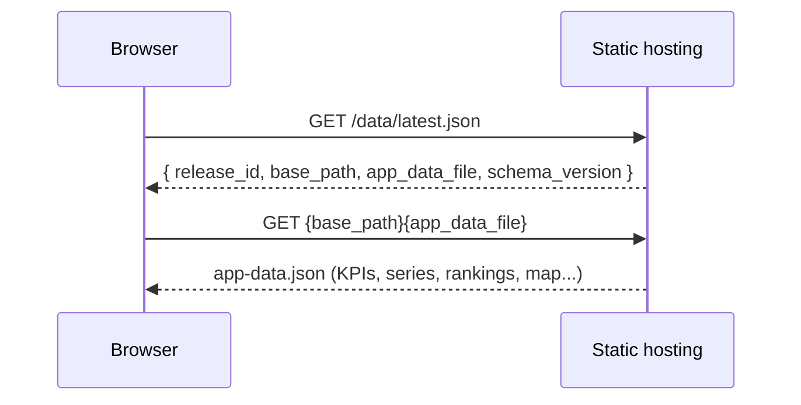
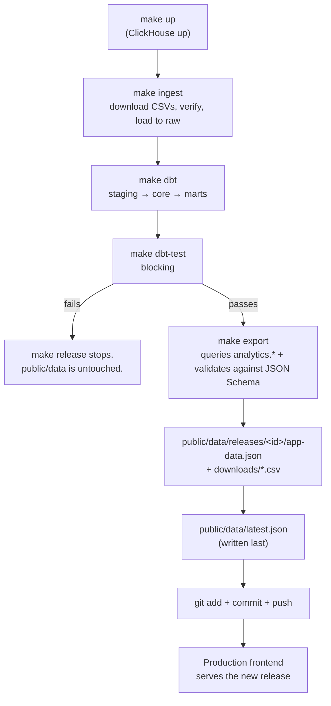

# How data gets updated in the app

*[Versión en español](actualizacion-datos.md)*

**Scope:** the full cycle from triggering a release to the frontend showing new numbers. For per-step detail, see [`docker.en.md`](docker.en.md), [`clickhouse.en.md`](clickhouse.en.md), and [`dbt.en.md`](dbt.en.md).

## Core principle: the frontend never computes anything

The public site **has no backend and no database of its own**. On every load, it makes two `fetch()` calls against static files:



This is implemented in a single module, `src/lib/data-client.ts` (`loadObservatoryData()`): it first resolves the `latest.json` pointer, validates that it has the expected keys and that `schema_version` starts with `"1."`, and only then requests the `app-data.json` that pointer references. If `schema_version` isn't compatible, it throws `SchemaIncompatibleError` and the app shows a controlled error state instead of breaking on data it doesn't understand.

All the computation (aggregations, joins, quality tests) already happened **before** this file existed. Updating the app's data means generating a new `app-data.json` and moving the pointer.

## The full cycle, step by step



`make release` (Makefile) chains the four central commands:

```bash
make release
# equivalent to:
make ingest
make dbt ARGS="--models stg_ core. marts."
make dbt-test ARGS="--models stg_ core. marts."
make export
```

### 1. Ingestion (`make ingest`)

`pipeline/src/pvm/ingest.py`. Per source (today S01 production, S02 registry — see `MODELO_DE_DATOS.md` for the rest):

1. Downloads the CSV with retries (3 attempts, backoff).
2. **Verifies before loading**: rejects HTML (a redirect/error disguised as a 200), empty files, and CSVs missing any critical column (`idpozo`, `anio`, `mes`, `empresa`, `prod_pet`) — i.e., an unapproved schema change stops the load instead of corrupting `raw`.
3. Computes the SHA-256 of the file while downloading it.
4. Compares it against the saved state (`StateStore`): if the checksum hasn't changed, **skips the load** (the file is identical to what's already loaded).
5. If it changed, loads into `raw_energy.*` with full provenance metadata (`_load_id`, `_source_url`, `_resource_id`, `_retrieved_at`, `_source_sha256`...).

`make ingest` only runs S01 by default. S02 is triggered separately (`cd pipeline && uv run python -m pvm.pipelines ingest --source s02` — it doesn't have its own Makefile target yet).

### 2. Transformation (`make dbt` + `make dbt-test`)

dbt rebuilds staging → core → marts in `analytics.*` (see [`dbt.en.md`](dbt.en.md) for the detail of each model). `dbt test` runs the declarative and singular tests — **if anything fails, the whole `make release` stops right there**: it never reaches `make export` with data that failed its own tests.

### 3. Export (`make export`)

`pipeline/src/pvm/export.py::main()`:

1. Runs the aggregation queries against `analytics.*` (national series, rankings, dimensions, quality, map).
2. Builds the full payload in memory (`versioned_payload()`).
3. **Validates the payload against `contracts/app-data.schema.json` (JSON Schema) before writing anything to disk.** A payload that fails the contract never reaches the point of overwriting an existing file.
4. Writes `public/data/releases/<release_id>/app-data.json` and the download CSV.
5. Only at the end does it write/overwrite `public/data/latest.json` — the pointer the frontend reads.

The order of step 5 is the key piece: if anything fails between step 1 and step 4, `latest.json` keeps pointing at the last valid release and the public site never learns a failed attempt happened.

> **Honesty note:** the target design (`architecture.md` §7.4) describes generating the release in a temp directory and copying it atomically. The current implementation writes directly into `releases/<id>/` — simpler, and sufficient because `release_id` is stable per monthly cutoff and Git is what versions the result. The real guarantee that "a broken release never gets published" comes from validating the contract *before* writing + updating `latest.json` last, not from an atomic `mv`.

### 4. Publishing (Git)

```bash
git add public/data/releases/<id>/ public/data/latest.json
git commit -m "release: <id>"
git push
```

`public/data/` is versioned in Git — not in `.gitignore` — because it **is** the public artifact. `pipeline/landing/` (downloaded CSVs) and `pipeline/history/` (run reports) are gitignored: they're reproducible from the sources, no need to version them.

With the frontend deployed on static hosting (see `architecture.md` §12-14 for the evaluated alternatives), pushing to the main branch triggers publishing the new version. The previous site stays available the whole time: there's no downtime, because there's nothing to "restart" — it's just a new static file replacing an old one.

## What happens when something breaks

| Failure at | Consequence | Recovery |
|---|---|---|
| Downloading a CSV | `DownloadError`, `make ingest` stops | Retry; the public source may be temporarily down |
| Schema verification | `VerifyError`, that source isn't loaded | Check whether the source changed columns; this is intentionally not automatic |
| `dbt test` | `make release` stops before `export` | `public/data/` stays untouched, still the previous release |
| Contract validation in `export.py` | Exception before writing any file | Nothing gets overwritten; fix the model/query and re-export |
| A published release has a visual bug | — | Revert the commit that updated `latest.json` (or the whole commit) and republish |

In every case, the property being preserved is the same: **the public site never shows a half-generated release.** Either the whole cycle completes (valid ingestion → green tests → valid contract → updated pointer), or the site keeps showing the last known-good release.

## Cadence

Today the cycle is manual (`make release` run by hand whenever the Secretaría de Energía publishes a new month). The PRD (`docs/PRD.md` §14) proposes weekly ingestion with publishing only when a new complete monthly period appears — automating that trigger (cron/CI) is a pending step, not yet implemented.

## See also

- [`docker.en.md`](docker.en.md) — how ClickHouse gets spun up to run this cycle.
- [`clickhouse.en.md`](clickhouse.en.md) — what's inside `analytics.*` that the exporter queries.
- [`dbt.en.md`](dbt.en.md) — what each model does between `raw` and the mart the exporter reads.
- [`architecture.md`](architecture.md) *(Spanish)* — full design of releases, contracts, and publishing (includes what's still aspirational).
