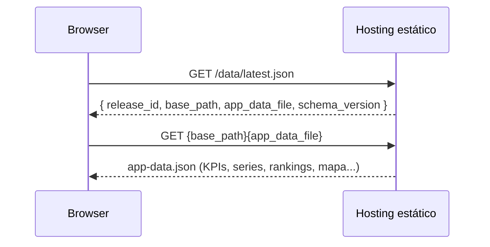
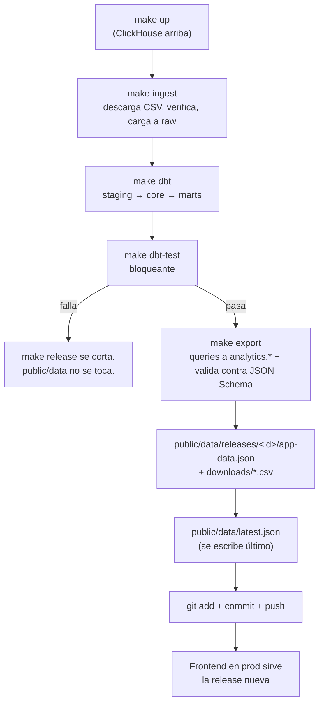

# Cómo se actualizan los datos en la app

*[English version](actualizacion-datos.en.md)*

**Alcance:** el ciclo completo desde que se dispara un release hasta que el frontend muestra números nuevos. Para el detalle de cada paso, ver [`docker.md`](docker.md), [`clickhouse.md`](clickhouse.md) y [`dbt.md`](dbt.md).

## Principio central: el frontend nunca calcula nada

El sitio público **no tiene backend ni base de datos propia**. En cada carga, hace dos `fetch()` contra archivos estáticos:



Esto está implementado en un único módulo, `src/lib/data-client.ts` (`loadObservatoryData()`): primero resuelve el puntero `latest.json`, valida que tenga las claves esperadas y que `schema_version` empiece con `"1."`, y recién después pide el `app-data.json` que ese puntero indica. Si `schema_version` no es compatible, lanza `SchemaIncompatibleError` y la app muestra un estado de error controlado en vez de romper con datos que no entiende.

Todo el cómputo (agregaciones, joins, tests de calidad) ya pasó **antes** de que este archivo exista. Actualizar los datos de la app = generar un nuevo `app-data.json` y mover el puntero.

## El ciclo completo, paso a paso



`make release` (Makefile) encadena los cuatro comandos centrales:

```bash
make release
# equivale a:
make ingest
make dbt ARGS="--models stg_ core. marts."
make dbt-test ARGS="--models stg_ core. marts."
make export
```

### 1. Ingesta (`make ingest`)

`pipeline/src/pvm/ingest.py`. Por fuente (hoy S01 producción, S02 padrón — ver `MODELO_DE_DATOS.md` para el resto):

1. Descarga el CSV con reintentos (3 intentos, backoff).
2. **Verifica** antes de cargar: rechaza HTML (redirect/error disfrazado de 200), archivos vacíos, y CSVs donde falta alguna columna crítica (`idpozo`, `anio`, `mes`, `empresa`, `prod_pet`) — es decir, un cambio de esquema no aprobado frena la carga en vez de corromper `raw`.
3. Calcula SHA-256 del archivo mientras lo descarga.
4. Compara contra el estado guardado (`StateStore`): si el checksum no cambió, **omite la carga** (el archivo es idéntico al ya cargado).
5. Si cambió, carga a `raw_energy.*` con la metadata de procedencia completa (`_load_id`, `_source_url`, `_resource_id`, `_retrieved_at`, `_source_sha256`...).

`make ingest` por defecto solo corre S01. S02 se dispara aparte (`cd pipeline && uv run python -m pvm.pipelines ingest --source s02` — todavía no tiene su propio target en el Makefile).

### 2. Transformación (`make dbt` + `make dbt-test`)

dbt reconstruye staging → core → marts en `analytics.*` (ver [`dbt.md`](dbt.md) para el detalle de cada modelo). `dbt test` corre los tests declarativos y singulares — **si algo falla, el `make release` completo se corta ahí**: nunca se llega a `make export` con un dato que no pasó sus propios tests.

### 3. Export (`make export`)

`pipeline/src/pvm/export.py::main()`:

1. Corre las queries de agregación contra `analytics.*` (serie nacional, rankings, dimensiones, calidad, mapa).
2. Arma el payload completo en memoria (`versioned_payload()`).
3. **Valida el payload contra `contracts/app-data.schema.json` (JSON Schema) antes de escribir nada a disco.** Un payload que no cumple el contrato nunca llega a pisar un archivo existente.
4. Escribe `public/data/releases/<release_id>/app-data.json` y el CSV de descarga.
5. Recién al final, escribe/pisa `public/data/latest.json` — el puntero que lee el frontend.

El orden del paso 5 es la pieza clave: si algo falla entre el paso 1 y el 4, `latest.json` sigue apuntando a la última release válida y el sitio público no se entera de que hubo un intento fallido.

> **Nota de honestidad:** el diseño objetivo (`architecture.md` §7.4) describe generar la release en un directorio temporal y copiarla de forma atómica. La implementación actual escribe directo en `releases/<id>/` — más simple, y suficiente porque `release_id` es estable por corte mensual y Git es quien versiona el resultado. La garantía real de "nunca publicar algo roto" la da la validación de contrato *antes* de escribir + el hecho de que `latest.json` se actualiza al final, no el `mv` atómico.

### 4. Publicación (Git)

```bash
git add public/data/releases/<id>/ public/data/latest.json
git commit -m "release: <id>"
git push
```

`public/data/` está versionado en Git — no en `.gitignore` — porque **es** el artefacto público. `pipeline/landing/` (CSVs descargados) y `pipeline/history/` (reportes de corrida) sí están ignorados: son reproducibles desde las fuentes, no hace falta versionarlos.

Con el frontend desplegado en un hosting estático (ver `architecture.md` §12-14 para las alternativas evaluadas), el push a la rama principal dispara la publicación de la nueva versión. El sitio anterior sigue disponible durante todo el proceso: no hay downtime, porque no hay nada que "reiniciar" — es un archivo estático nuevo reemplazando a uno viejo.

## Qué pasa si algo sale mal

| Falla en | Consecuencia | Recuperación |
|---|---|---|
| Descarga de un CSV | `DownloadError`, `make ingest` corta | Reintentar; la fuente pública puede estar caída temporalmente |
| Verificación de esquema | `VerifyError`, esa fuente no se carga | Revisar si la fuente cambió columnas; no es automático a propósito |
| `dbt test` | `make release` corta antes de `export` | `public/data/` queda intacto con la release anterior |
| Validación de contrato en `export.py` | Excepción antes de escribir cualquier archivo | Nada se pisa; corregir el modelo/query y reexportar |
| Release ya publicada tiene un bug visual | — | Revertir el commit que actualizó `latest.json` (o el commit completo) y volver a publicar |

En todos los casos, la propiedad que se preserva es la misma: **el sitio público nunca muestra una release a medio generar.** O se completa el ciclo entero (ingesta válida → tests verdes → contrato válido → puntero actualizado), o el sitio sigue mostrando la última release buena conocida.

## Cadencia

Hoy el ciclo es manual (`make release` corrido a mano cuando la Secretaría de Energía publica un mes nuevo). El PRD (`docs/PRD.md` §14) propone ingesta semanal con publicación solo cuando aparece un período mensual completo nuevo — automatizar ese disparador (cron/CI) es un paso pendiente, no implementado todavía.

## Ver también

- [`docker.md`](docker.md) — cómo se levanta ClickHouse para correr este ciclo.
- [`clickhouse.md`](clickhouse.md) — qué hay dentro de `analytics.*` que consulta el exporter.
- [`dbt.md`](dbt.md) — qué hace cada modelo entre `raw` y el mart que lee el exporter.
- [`architecture.md`](architecture.md) — diseño completo de releases, contratos y publicación (incluye lo que todavía es aspiracional).
