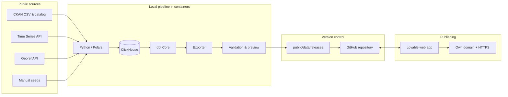

# Architecture — Pulso Vaca Muerta

*[Versión en español](architecture.md)*

**Version:** 0.4
**Date:** September 2, 2026
**Status:** Pipeline operational (S01 + S02 complete, real data generated); frontend consumes real data.

## 1. Summary

Pulso Vaca Muerta fully separates data processing from the public application:

- The pipeline runs locally once a month (currently via `uv run` from the host; containers for ingestion/dbt/exporter are still pending).
- ClickHouse and dbt process and validate the data on the project's machine.
- An exporter turns approved marts into static JSON, CSV, and GeoJSON.
- The app built in Lovable consumes only those artifacts.
- Lovable keeps the frontend available on its own domain with HTTPS, even if the local machine is turned off.

There's no public connection to ClickHouse, no query backend, no cloud database, and no real-time processing.

The boundary between both worlds is a **monthly release of static, versioned, validated, immutable data**.

> **Current status (2026-09-02):** the pipeline is operational for S01 (well production) and S02 (well registry). ClickHouse holds 18.2M raw rows. The dbt models (`stg_energy__well_production`, `stg_energy__wells`, `dim_date_month`, `dim_operator`, `dim_well`, `fact_well_monthly_production`, `mart_argentina_monthly_production`) compile and pass all their tests. The exporter generates `app-data.json` with real KPIs, rankings, a map (populated from `dim_well`, no longer parsing raw CSVs), and downloads; quality checks run as real queries against ClickHouse (6 checks). Pending: `quality.join_coverage` (still `[]`), S03/S04 ingestion, cohorts, and completions. See [`docs/README.md`](README.md) *(Spanish)* for the full status table and [`docs/dbt.en.md`](dbt.en.md) / [`docs/clickhouse.en.md`](clickhouse.en.md) / [`docs/docker.en.md`](docker.en.md) / [`docs/actualizacion-datos.en.md`](actualizacion-datos.en.md) for per-component detail.

## 2. General diagram



## 3. Architectural principles

1. **No local-machine dependency at runtime.** The local environment going down or being turned off doesn't affect the published site.
2. **No backend in the MVP.** The browser consumes previously generated static files.
3. **Monthly processing.** Sources don't need real-time updates.
4. **ClickHouse won't be public.** It only listens inside the local Docker network.
5. **Raw stays local; aggregates go public.** Full files and detail facts aren't shipped with the frontend.
6. **Immutable releases.** Every publish has an identifier and is never modified after being released.
7. **Atomic publishing.** The `latest.json` pointer only updates once every artifact has been validated.
8. **Explicit contract.** The exporter and the frontend share versioned schemas.
9. **Last valid version.** If a run fails, the site keeps showing the previous release.
10. **Minimal operating cost.** The heavy computation happens locally; public hosting just serves static files.

## 4. Local components

### 4.1 ClickHouse

A persistent service while the pipeline is running.

Responsibilities:

- Store raw versions of the sources.
- Run analytical transformations.
- Maintain dimensions, facts, and marts.
- Resolve high-volume aggregations before export.

The volume will be kept in a local Docker volume to allow incremental updates. ClickHouse won't be exposed to the Internet.

### 4.2 Ingestion

Target design: a container based on Python and Polars. **Real status:** runs locally via `uv run` (`pipeline/`), not containerized — see [`docker.en.md`](docker.en.md) for why design and current status differ here.

Implemented today: S01 ingestion (production) and S02 (well registry, with a derived `dim_well`). S03/S04 remain for Phase 2.

Responsibilities:

- Query CKAN and API metadata.
- Download CSVs and JSON responses.
- Compute checksums.
- Maintain an immutable landing area.
- Detect schema or content changes.
- Load raw tables into ClickHouse.
- Record `load_id`, timestamps, URL, and SHA-256.

### 4.3 dbt

Target design: an ephemeral container with dbt Core and `dbt-clickhouse`. **Real status:** runs locally (`uv run dbt ...`) against the containerized ClickHouse — see [`dbt.en.md`](dbt.en.md) for the detail of implemented models, layers, and tests.

Responsibilities:

- Staging and normalization.
- Dimensional models.
- Facts and marts.
- Incremental models.
- Quality and relationship tests.
- Documentation and lineage.
- Reconciliation against national series.

The container starts, runs `dbt build`, and exits. It isn't a permanent service.

### 4.4 Exporter

A container, or a command within the same Python ingestion environment.

Responsibilities:

- Query approved marts only.
- Export JSON, CSV, and GeoJSON optimized for the web.
- Partition large datasets.
- Simplify geometries.
- Compute checksums for the artifacts.
- Build the release manifest.
- Validate files against the contracts.

### 4.5 Preview & QA

Before publishing, the web app is spun up locally against the just-generated release.

Checks:

- Navigation and filters.
- Loading of every artifact.
- Compatibility with the frontend contract.
- Empty charts or impossible values.
- Basic responsiveness.
- Data cutoff date and quality status visible.

Metabase can be added as an optional local exploration tool. It won't be part of the production site.

## 5. Docker Compose

Conceptual structure (target design). **The repo's real `docker-compose.yml` today only defines the `clickhouse` service** — see [`docker.en.md`](docker.en.md) for the real file, why ingestion/dbt/exporter aren't containerized yet, and how to operate the current environment:

```yaml
services:
  clickhouse:
    image: clickhouse/clickhouse-server
    volumes:
      - clickhouse_data:/var/lib/clickhouse

  ingestion:
    build: ./pipeline
    depends_on:
      - clickhouse

  dbt:
    build: ./dbt
    depends_on:
      - clickhouse

  exporter:
    build: ./pipeline
    depends_on:
      - clickhouse

  metabase:
    image: metabase/metabase
    profiles:
      - qa
```

ClickHouse will be the only container normally persistent across a run. Ingestion, dbt, and exporter run a command and exit.

## 6. Monthly run

The operating interface will be a single command:

```bash
make release
```

Proposed internal flow:

```bash
docker compose up -d clickhouse
docker compose run --rm ingestion
docker compose run --rm dbt dbt deps
docker compose run --rm dbt dbt build
docker compose run --rm exporter
docker compose down
```

The real target will add:

- ClickHouse healthcheck.
- Error handling.
- Run IDs.
- Persistent logs.
- Schema validation.
- Quality report generation.
- Local preview.

Airflow won't be included in the MVP. A monthly, linear run operated by a single person doesn't initially justify its complexity. It can be added if sources, frequency, backfills, or dependencies grow.

## 7. The data release

### 7.1 Structure

```text
web/public/data/
├── latest.json
└── releases/
    ├── 2026-07/
    │   └── ...
    └── 2026-08/
        ├── manifest.json
        ├── kpis.json
        ├── monthly-production.json
        ├── unconventional-share.json
        ├── operator-rankings.json
        ├── cohort-curves.json
        ├── completion-productivity.json
        ├── data-quality.json
        ├── downloads/
        │   ├── monthly-production.csv
        │   └── operator-rankings.csv
        └── maps/
            ├── wells-summary.geojson
            └── trajectories-simplified.geojson
```

### 7.2 Release pointer

Example `latest.json`:

```json
{
  "release_id": "2026-08",
  "data_cutoff": "2026-07-31",
  "generated_at": "2026-08-27T03:20:00Z",
  "schema_version": "1.0",
  "status": "complete",
  "base_path": "/data/releases/2026-08/"
}
```

The application loads this file first and then resolves the remaining URLs from `base_path`.

### 7.3 Manifest

`manifest.json` will include:

- Release identifier.
- Data cutoff date.
- Contract version.
- Pipeline commit or version.
- `dbt invocation_id`.
- Sources and their modification dates.
- List of artifacts.
- Size and SHA-256 of each file.
- Test and reconciliation status.
- Non-blocking warnings.

### 7.4 Atomic publishing

Mandatory order:

1. Generate the release in a temporary directory.
2. Validate every artifact.
3. Copy the immutable folder to `releases/<release_id>`.
4. Verify the frontend can read it.
5. Update `latest.json` last.

An error before step 5 leaves the previous public release untouched.

## 8. Contracts between pipeline and frontend

Proposed directory:

```text
contracts/
├── release-manifest.schema.json
├── kpis.schema.json
├── monthly-production.schema.json
├── operator-ranking.schema.json
├── cohort-curve.schema.json
└── data-quality.schema.json
```

The exporter will validate each file before promoting it. The frontend will have TypeScript types generated or maintained from the same contracts.

Rules:

- An incompatible change bumps the major `schema_version`.
- Adding an optional field bumps the minor version.
- The frontend must reject an unknown major version with a controlled message.
- Missing numeric values are `null`, never empty strings.
- Dates in ISO 8601.
- Every measure has a documented unit.

## 9. Visualization-oriented artifacts

The browser never queries the full monthly fact. Datasets are designed per view.

| View | Artifact | Strategy |
| ---------- | ------------------------------------------------ | -------------------------------------------------------------------------------------------------------------- |
| Home | `kpis.json`, `monthly-production.json` | Small, loaded on startup. |
| Explorer | Aggregates by dimension | Partitioned by product/year if they grow. |
| Operators | `operator-rankings.json` and per-operator files | Lazy loading. |
| Cohorts | `cohort-curves.json` | Percentiles and counts already computed. |
| Fractures | `completion-productivity.json` | Buckets and coverage, no raw rows. |
| Quality | `data-quality.json` | Counts, rules, and status. |
| Map | Simplified GeoJSON | Popup, color modes, and fallback table (implemented). Clustering, partitioning, and progressive loading pending. |
| Downloads | Aggregated CSV | Public and journalistic reuse. |

Large files can be partitioned:

```text
operator-production/
├── ypf.json
├── vista-energy.json
└── tecpetrol.json
```

## 10. Visualization layer in Lovable

### Implemented stack (mockup)

- React and TypeScript, maintained through Lovable and this repository.
- **Recharts** for series, compositions, and rankings (with ≫ 5 series).
- **MapLibre** for the map (Esri World Dark Gray Canvas basemap + references; free, no API key).
- Simple shadcn/HTML tables; `@tanstack/react-table` got installed but is unused.
- Filters persisted in query parameters (shareable URLs).
- Lazy loading per route; data fetched client-side only, with `loading | ready | error | schema-incompatible` states.

### Implemented routes

```text
/                          Monthly summary (KPIs and trend)
/produccion                Explorer with filters and comparison by dimension
/operadores                Operator ranking
/operadores/:slug          Operator profile (its own curves and cohorts)
/pozos-y-cohortes          Decline curves by cohort
/fracturas                 Completion and cumulative productivity
/mapa                      Wells + trajectories (popup, color modes, fallback table)
/calidad                   Quality, freshness, and reconciliation
/metodologia               Definitions, sources, and methodology
/descargas                 Downloads center
/periodos/:releaseId       Archive of published periods
```

### Presentation rules

- Show the data cutoff date on every page.
- Distinguish complete periods from partial ones.
- Include unit, source, and methodology on every chart.
- Keep a fallback table for relevant visualizations (present in the explorer and well/cohort view; pending on the home page).
- Avoid averages without a sample count.
- Generate shareable URLs that preserve filters.
- Prepare SEO metadata and social cards per release.

No Supabase or managed database will be used for the MVP. The product doesn't need authentication, user writes, or dynamic server queries.

## 11. Repository and Lovable integration

A monorepo is recommended:

```text
pulso-vaca-muerta/
├── pipeline/
├── dbt/
├── contracts/
├── web/
│   ├── src/
│   └── public/data/
├── docker-compose.yml
├── Makefile
└── docs/
```

The Lovable project connects to GitHub via bidirectional sync on the main branch. Changes made locally and pushed to GitHub flow back into the Lovable project; changes made in Lovable are also reflected in the repository.

Official documentation: [GitHub integration](https://docs.lovable.dev/integrations/github).

GitHub will be the source of truth for the code and the public releases. Full raw data, Docker volumes, logs, and credentials will be git-ignored.

## 12. Publishing on Lovable

Recommended monthly flow:

1. Run `make release`.
2. Review the quality report.
3. Test the app locally against the new release.
4. Commit the new folder and `latest.json`.
5. Push to GitHub.
6. Confirm sync with Lovable.
7. Run **Publish → Update**.
8. Validate the public domain.

Lovable documents that updates to a published app are promoted via **Publish → Update**. Syncing with GitHub isn't treated as equivalent to automatic publishing.

Official documentation: [Publish your Lovable project](https://docs.lovable.dev/features/publish).

The app keeps serving the previous release throughout any pipeline failure or delay in publishing.

## 13. Domain and availability

Lovable hosts the static app on a custom domain and manages the SSL certificate. The domain can be configured via Entri or manual DNS records.

Official documentation: [Custom domains](https://docs.lovable.dev/features/custom-domain).

Expected availability:

- The site doesn't depend on the local machine.
- The site doesn't depend on ClickHouse at runtime.
- There's no API of its own to maintain.
- A failed monthly run doesn't interrupt the currently live public version.

## 14. Deployment alternatives

### Alternative A — Recommended for the MVP

**Lovable hosting + release bundled inside `public/data`.**

Advantages:

- Fewer moving parts.
- Domain and SSL already solved.
- No CORS.
- Preview identical to the published bundle.
- Simple monthly operation.

Disadvantage:

- Requires `Publish → Update` after every release.

### Alternative B — Lovable frontend deployed externally

Code built in Lovable can be deployed from GitHub to Cloudflare Pages, Netlify, Vercel, or another static host. Every push can trigger an automatic publish.

Official documentation: [External deployment and hosting](https://docs.lovable.dev/tips-tricks/external-deployment-hosting).

Advantage:

- Fully automatic deploy.

Disadvantages:

- The domain stops being managed directly by Lovable hosting.
- Another platform and its configuration get added.

### Alternative C — Lovable hosting + separate static data hosting

The app stays published on Lovable, but queries `https://data.example.com/latest.json`. The pipeline updates that data hosting without republishing the frontend.

Advantage:

- Data releases don't require updating the app.

Disadvantages:

- CORS and cache invalidation.
- A second domain and provider.
- More operational complexity.

Not recommended for the MVP.

## 15. Cache and versioning

- `releases/<id>` folders can have a long cache lifetime because they're immutable.
- `latest.json` should have a short cache or a cache-busting strategy.
- Assets are referenced by release ID, never by mutable names.
- The frontend can remember the last loaded release during a session, but must always show its ID and cutoff date.
- At least 12 public releases will be kept for rollback and historical URLs.

## 16. Security

- No secrets in `VITE_*` variables; they're visible in the browser.
- ClickHouse will only exist on the local Docker network.
- No ClickHouse port will be exposed outside localhost.
- Raw CSVs and administrative files won't be copied into `web/public`.
- The exporter will apply a column allowlist.
- The frontend won't execute SQL or accept arbitrary URLs.
- Publishing must pass Lovable's security check.

## 17. Observability

Every run will generate:

```text
artifacts/runs/<load_id>/
├── run-manifest.json
├── ingestion-report.json
├── dbt-run-results.json
├── source-freshness.json
├── reconciliation.json
├── quality-summary.json
└── export-manifest.json
```

The web app will show a safe subset on the quality page:

- Last successful run.
- Each source's date.
- Active release.
- Rows processed.
- Join coverage.
- Passed tests and warnings.

## 18. Recovery and rollback

### Download failure

- Don't replace the last valid raw version.
- Mark the source as stale.
- Don't promote the release if it affects critical metrics.

### dbt or reconciliation failure

- Keep logs and artifacts.
- Don't modify `latest.json`.
- The site keeps serving the previous release.

### Visual failure after publishing

- Revert `latest.json` or the entire commit.
- Run Publish → Update again.
- Keep the defective release out of `latest` for investigation.

## 19. Development flow

```text
feature branch
    ↓
pipeline + dbt + contract + frontend tests
    ↓
pull request
    ↓
merge to main
    ↓
sync with Lovable
    ↓
preview
    ↓
controlled manual publish
```

UI changes can be made in Lovable. Pipeline, dbt, contract, and release changes are made locally.

## 20. Recommended decision

For the MVP, the project adopts:

- A monorepo.
- ClickHouse, Python, and dbt run locally with Docker Compose.
- One monthly run via `make release`.
- Marts exported to JSON, CSV, and GeoJSON.
- Releases bundled inside `web/public/data`.
- GitHub connected bidirectionally with Lovable.
- Human review and a monthly `Publish → Update`.
- Domain and SSL managed by Lovable.
- No Supabase, public backend, ClickHouse Cloud, or permanent compute.

This solution keeps public availability decoupled from local infrastructure, minimizes costs, and preserves a clear, demonstrable technical story: the app serves already-validated analytical results, while the heavy processing happens once a month in a reproducible environment.
