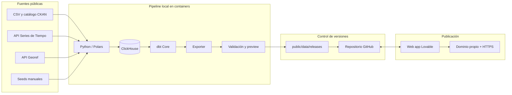

# Arquitectura — Pulso Vaca Muerta

**Versión:** 0.1  
**Fecha:** 27 de agosto de 2026  
**Estado:** Arquitectura propuesta para el MVP

## 1. Resumen

Pulso Vaca Muerta separará completamente el procesamiento de datos de la aplicación pública:

- El pipeline se ejecutará localmente una vez por mes mediante containers.
- ClickHouse y dbt procesarán y validarán los datos en la computadora del proyecto.
- Un exporter convertirá los marts aprobados en JSON, CSV y GeoJSON estáticos.
- La aplicación creada en Lovable consumirá exclusivamente esos artefactos.
- Lovable mantendrá el frontend disponible en un dominio propio con HTTPS, aunque la computadora local esté apagada.

No habrá conexión pública con ClickHouse, backend de consultas, base de datos cloud ni procesamiento en tiempo real.

La frontera entre ambos mundos será un **release mensual de datos estáticos, versionado, validado e inmutable**.

## 2. Diagrama general



## 3. Principios arquitectónicos

1. **Sin dependencia de la computadora local en runtime.** La caída o apagado del entorno local no afecta al sitio publicado.
2. **Sin backend en el MVP.** El navegador consume archivos estáticos generados previamente.
3. **Procesamiento mensual.** Las fuentes no requieren actualización en tiempo real.
4. **ClickHouse no será público.** Solo escucha dentro de la red Docker local.
5. **Raw local; agregados públicos.** Los archivos completos y facts de detalle no se distribuyen con el frontend.
6. **Releases inmutables.** Cada publicación tiene un identificador y no se modifica después de liberarse.
7. **Publicación atómica.** El puntero `latest.json` se actualiza únicamente cuando todos los artefactos fueron validados.
8. **Contrato explícito.** Exporter y frontend comparten esquemas versionados.
9. **Última versión válida.** Si una corrida falla, el sitio continúa mostrando la release anterior.
10. **Costo operativo mínimo.** El cómputo pesado ocurre localmente; el hosting público sirve archivos estáticos.

## 4. Componentes locales

### 4.1 ClickHouse

Servicio persistente mientras el pipeline está en ejecución.

Responsabilidades:

- Almacenar las versiones raw de las fuentes.
- Ejecutar transformaciones analíticas.
- Mantener dimensiones, facts y marts.
- Resolver agregaciones de alto volumen antes de exportar.

El volumen se conservará en un Docker volume local para permitir actualizaciones incrementales. ClickHouse no se expondrá a Internet.

### 4.2 Ingestion

Container basado en Python y Polars.

Responsabilidades:

- Consultar metadata de CKAN y APIs.
- Descargar CSV y respuestas JSON.
- Calcular checksums.
- Mantener un landing inmutable.
- Detectar cambios de esquema o contenido.
- Cargar tablas raw en ClickHouse.
- Registrar `load_id`, timestamps, URL y SHA-256.

### 4.3 dbt

Container efímero con dbt Core y `dbt-clickhouse`.

Responsabilidades:

- Staging y normalización.
- Modelos dimensionales.
- Facts y marts.
- Modelos incrementales.
- Tests de calidad y relaciones.
- Documentación y lineage.
- Reconciliación contra series nacionales.

El container inicia, ejecuta `dbt build` y termina. No es un servicio permanente.

### 4.4 Exporter

Container o comando del mismo entorno Python de ingesta.

Responsabilidades:

- Consultar únicamente marts aprobados.
- Exportar JSON, CSV y GeoJSON optimizados para web.
- Particionar datasets grandes.
- Simplificar geometrías.
- Calcular checksums de los artefactos.
- Crear el manifest del release.
- Validar los archivos contra contratos.

### 4.5 Preview y QA

Antes de publicar se levantará localmente la aplicación web contra el release recién generado.

Validaciones:

- Navegación y filtros.
- Carga de todos los artefactos.
- Compatibilidad con el contrato del frontend.
- Gráficos vacíos o valores imposibles.
- Responsive básico.
- Fecha de corte y estado de calidad visibles.

Metabase puede agregarse como herramienta opcional de exploración local. No formará parte del sitio de producción.

## 5. Docker Compose

Estructura conceptual:

```yaml
services:
  clickhouse:
    image: clickhouse/clickhouse-server
    volumes:
      - clickhouse_data:/var/lib/clickhouse

  ingestion:
    build: ./pipeline
    depends_on:
      - clickhouse

  dbt:
    build: ./dbt
    depends_on:
      - clickhouse

  exporter:
    build: ./pipeline
    depends_on:
      - clickhouse

  metabase:
    image: metabase/metabase
    profiles:
      - qa
```

ClickHouse será el único container normalmente persistente durante una corrida. Ingestion, dbt y exporter ejecutan un comando y terminan.

## 6. Ejecución mensual

La interfaz operativa será un comando:

```bash
make release
```

Flujo interno propuesto:

```bash
docker compose up -d clickhouse
docker compose run --rm ingestion
docker compose run --rm dbt dbt deps
docker compose run --rm dbt dbt build
docker compose run --rm exporter
docker compose down
```

El target real agregará:

- Healthcheck de ClickHouse.
- Manejo de errores.
- IDs de ejecución.
- Logs persistentes.
- Validación de schemas.
- Generación de reporte de calidad.
- Preview local.

No se incluirá Airflow en el MVP. Una ejecución mensual, lineal y operada por una sola persona no justifica inicialmente su complejidad. Puede incorporarse si aumentan fuentes, frecuencia, backfills o dependencias.

## 7. El release de datos

### 7.1 Estructura

```text
web/public/data/
├── latest.json
└── releases/
    ├── 2026-07/
    │   └── ...
    └── 2026-08/
        ├── manifest.json
        ├── kpis.json
        ├── monthly-production.json
        ├── unconventional-share.json
        ├── operator-rankings.json
        ├── cohort-curves.json
        ├── completion-productivity.json
        ├── data-quality.json
        ├── downloads/
        │   ├── monthly-production.csv
        │   └── operator-rankings.csv
        └── maps/
            ├── wells-summary.geojson
            └── trajectories-simplified.geojson
```

### 7.2 Puntero de release

Ejemplo de `latest.json`:

```json
{
  "release_id": "2026-08",
  "data_cutoff": "2026-07-31",
  "generated_at": "2026-08-27T03:20:00Z",
  "schema_version": "1.0",
  "status": "complete",
  "base_path": "/data/releases/2026-08/"
}
```

La aplicación carga primero este archivo y luego resuelve las URLs restantes desde `base_path`.

### 7.3 Manifest

`manifest.json` incluirá:

- Identificador de release.
- Fecha de corte.
- Versión de contrato.
- Commit o versión del pipeline.
- `dbt invocation_id`.
- Fuentes y fechas de modificación.
- Lista de artefactos.
- Tamaño y SHA-256 de cada archivo.
- Estado de tests y reconciliaciones.
- Advertencias no bloqueantes.

### 7.4 Publicación atómica

Orden obligatorio:

1. Generar el release en un directorio temporal.
2. Validar todos los artefactos.
3. Copiar la carpeta inmutable a `releases/<release_id>`.
4. Verificar que el frontend pueda leerla.
5. Actualizar `latest.json` al final.

Un error antes del paso 5 deja intacta la release pública anterior.

## 8. Contratos entre pipeline y frontend

Directorio propuesto:

```text
contracts/
├── release-manifest.schema.json
├── kpis.schema.json
├── monthly-production.schema.json
├── operator-ranking.schema.json
├── cohort-curve.schema.json
└── data-quality.schema.json
```

El exporter validará cada archivo antes de promoverlo. El frontend tendrá tipos TypeScript generados o mantenidos a partir de los mismos contratos.

Reglas:

- Un cambio incompatible incrementa `schema_version` mayor.
- Agregar un campo opcional incrementa versión menor.
- El frontend debe rechazar una versión mayor desconocida con un mensaje controlado.
- Los valores numéricos faltantes serán `null`, no strings vacíos.
- Fechas en ISO 8601.
- Cada medida tendrá unidad documentada.

## 9. Artefactos orientados a visualización

El navegador no consultará el fact mensual completo. Los datasets se diseñarán según cada vista.

| Vista | Artefacto | Estrategia |
|---|---|---|
| Home | `kpis.json`, `monthly-production.json` | Pequeños y cargados al inicio. |
| Explorador | Agregados por dimensión | Particionados por producto/año si crecen. |
| Operadores | `operator-rankings.json` y archivos por operador | Lazy loading. |
| Cohortes | `cohort-curves.json` | Percentiles y conteos ya calculados. |
| Fracturas | `completion-productivity.json` | Buckets y cobertura, sin filas raw. |
| Calidad | `data-quality.json` | Conteos, reglas y estado. |
| Mapa | GeoJSON simplificado | Clustering, partición y carga progresiva. |
| Descargas | CSV agregados | Reutilización pública y periodística. |

Los archivos grandes podrán particionarse:

```text
operator-production/
├── ypf.json
├── vista-energy.json
└── tecpetrol.json
```

## 10. Capa de visualización en Lovable

### Stack propuesto

- React y TypeScript, generados y mantenidos mediante Lovable.
- ECharts o Recharts para series, composiciones y rankings.
- MapLibre para mapas.
- TanStack Table para tablas y exploradores.
- Filtros persistidos en query parameters.
- Carga diferida por ruta y dataset.

### Rutas iniciales

```text
/
/produccion
/operadores
/operadores/:slug
/pozos-y-cohortes
/fracturas
/mapa
/calidad
/metodologia
/descargas
/periodos/:releaseId
```

### Reglas de presentación

- Mostrar fecha de corte en todas las páginas.
- Diferenciar períodos completos y parciales.
- Incluir unidad, fuente y metodología en cada gráfico.
- Mantener tabla alternativa para visualizaciones relevantes.
- Evitar promedios sin conteo de muestra.
- Generar URLs compartibles que preserven filtros.
- Preparar metadata SEO y tarjetas sociales por release.

No se usará Supabase ni una base de datos gestionada para el MVP. El producto no necesita autenticación, escrituras de usuarios ni consultas dinámicas de servidor.

## 11. Repositorio e integración con Lovable

Se recomienda un monorepo:

```text
pulso-vaca-muerta/
├── pipeline/
├── dbt/
├── contracts/
├── web/
│   ├── src/
│   └── public/data/
├── docker-compose.yml
├── Makefile
└── docs/
```

El proyecto Lovable se conectará con GitHub mediante sincronización bidireccional sobre la rama principal. Los cambios hechos localmente y enviados a GitHub volverán al proyecto Lovable; los cambios hechos en Lovable también se reflejarán en el repositorio.

Documentación oficial: [GitHub integration](https://docs.lovable.dev/integrations/github).

GitHub será la fuente de verdad del código y de los releases públicos. Los datos raw completos, Docker volumes, logs y credenciales estarán ignorados por Git.

## 12. Publicación en Lovable

Flujo mensual recomendado:

1. Ejecutar `make release`.
2. Revisar el reporte de calidad.
3. Probar la aplicación localmente contra el nuevo release.
4. Commit de la nueva carpeta y `latest.json`.
5. Push a GitHub.
6. Confirmar sincronización con Lovable.
7. Ejecutar **Publish → Update**.
8. Validar el dominio público.

Lovable documenta que las actualizaciones de una app publicada se promueven mediante **Publish → Update**. La sincronización con GitHub no se considerará equivalente a publicación automática.

Documentación oficial: [Publish your Lovable project](https://docs.lovable.dev/features/publish).

La aplicación seguirá disponible con el release anterior durante cualquier falla del pipeline o demora en la publicación.

## 13. Dominio y disponibilidad

Lovable alojará la aplicación estática en un dominio personalizado y gestionará el certificado SSL. El dominio puede configurarse mediante Entri o registros DNS manuales.

Documentación oficial: [Custom domains](https://docs.lovable.dev/features/custom-domain).

Disponibilidad esperada:

- El sitio no depende de la computadora local.
- El sitio no depende de ClickHouse en runtime.
- No existe una API propia que mantener.
- Una corrida mensual fallida no interrumpe la versión pública vigente.

## 14. Alternativas de deployment

### Alternativa A — Recomendada para el MVP

**Lovable hosting + release empaquetado en `public/data`.**

Ventajas:

- Menor cantidad de componentes.
- Dominio y SSL ya resueltos.
- Sin CORS.
- Preview idéntico al bundle publicado.
- Operación mensual sencilla.

Desventaja:

- Requiere `Publish → Update` después de cada release.

### Alternativa B — Frontend Lovable desplegado externamente

El código creado en Lovable puede desplegarse desde GitHub en Cloudflare Pages, Netlify, Vercel u otro hosting estático. Cada push puede disparar una publicación automática.

Documentación oficial: [External deployment and hosting](https://docs.lovable.dev/tips-tricks/external-deployment-hosting).

Ventaja:

- Deploy completamente automático.

Desventajas:

- El dominio deja de estar gestionado directamente por el hosting Lovable.
- Se incorpora otra plataforma y su configuración.

### Alternativa C — Lovable hosting + hosting estático de datos separado

La app permanece publicada en Lovable, pero consulta `https://data.example.com/latest.json`. El pipeline actualiza ese hosting de datos sin republicar el frontend.

Ventaja:

- Los releases de datos no requieren actualizar la app.

Desventajas:

- CORS y cache invalidation.
- Segundo dominio y proveedor.
- Mayor complejidad operativa.

No se recomienda para el MVP.

## 15. Cache y versionado

- Las carpetas `releases/<id>` pueden tener cache largo porque son inmutables.
- `latest.json` debe tener cache corto o estrategia de cache busting.
- Los assets se referencian mediante release ID, no mediante nombres mutables.
- El frontend puede recordar la última release cargada durante una sesión, pero siempre debe mostrar su ID y fecha de corte.
- Se conservarán al menos 12 releases públicas para rollback y URLs históricas.

## 16. Seguridad

- No incluir secretos en variables `VITE_*`; son visibles en el navegador.
- ClickHouse solo estará en la red Docker local.
- Ningún puerto de ClickHouse se expondrá fuera de localhost.
- Los CSV raw y archivos administrativos no se copiarán a `web/public`.
- El exporter aplicará allowlist de columnas.
- El frontend no ejecutará SQL ni aceptará URLs arbitrarias.
- La publicación debe pasar el security check de Lovable.

## 17. Observabilidad

Cada ejecución generará:

```text
artifacts/runs/<load_id>/
├── run-manifest.json
├── ingestion-report.json
├── dbt-run-results.json
├── source-freshness.json
├── reconciliation.json
├── quality-summary.json
└── export-manifest.json
```

La web mostrará un subconjunto seguro en la página de calidad:

- Última corrida exitosa.
- Fecha de cada fuente.
- Release activa.
- Filas procesadas.
- Cobertura de joins.
- Tests aprobados y advertencias.

## 18. Recuperación y rollback

### Falla de descarga

- No reemplazar la última versión raw válida.
- Marcar fuente como stale.
- No promover release si afecta métricas críticas.

### Falla de dbt o reconciliación

- Conservar logs y artefactos.
- No modificar `latest.json`.
- El sitio continúa con la release anterior.

### Falla visual posterior a publicación

- Revertir `latest.json` o el commit completo.
- Ejecutar nuevamente Publish → Update.
- Mantener la release defectuosa fuera de `latest` para investigación.

## 19. Flujo de desarrollo

```text
feature branch
    ↓
tests de pipeline + dbt + contratos + frontend
    ↓
pull request
    ↓
merge a main
    ↓
sincronización con Lovable
    ↓
preview
    ↓
publicación manual controlada
```

Los cambios de UI pueden realizarse en Lovable. Los cambios de pipeline, dbt, contratos y releases se harán localmente.

## 20. Decisión recomendada

Para el MVP se adopta:

- Un monorepo.
- ClickHouse, Python y dbt ejecutados localmente con Docker Compose.
- Una corrida mensual mediante `make release`.
- Marts exportados a JSON, CSV y GeoJSON.
- Releases empaquetados dentro de `web/public/data`.
- GitHub conectado bidireccionalmente con Lovable.
- Revisión humana y `Publish → Update` mensual.
- Dominio y SSL gestionados por Lovable.
- Sin Supabase, backend público, ClickHouse Cloud ni cómputo permanente.

Esta solución mantiene la disponibilidad pública desacoplada de la infraestructura local, minimiza costos y conserva una historia técnica clara y demostrable: la aplicación sirve resultados analíticos ya validados, mientras el procesamiento pesado ocurre una vez por mes en un entorno reproducible.

