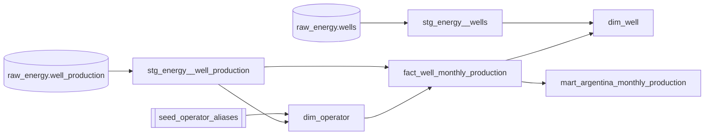

# dbt — data transformation

*[Versión en español](dbt.md)*

**Scope:** how the dbt project (`dbt/`) is organized, what each layer does, how it's tested, and how it's run.

dbt (`dbt-core` + the `dbt-clickhouse` adapter) takes the raw tables loaded by the ingestion pipeline and turns them, through versioned and tested SQL, into the tables the exporter consumes. There's no business logic in Python beyond loading: all modeling lives in `dbt/models/`.

## Why dbt

- Transformation SQL stays versioned, reviewable in a PR, and documented alongside the data it produces.
- Tests (`unique`, `not_null`, singular SQL tests) run before export and block a publish with broken data.
- The dependency graph (`ref()`) removes manual ordering: dbt figures out which model runs before which.
- `dbt-clickhouse` is mature enough for this use case: columnar aggregations over ~18M rows in seconds.

## Project structure

```text
dbt/
├── dbt_project.yml       # config: paths, per-folder materializations, vars
├── profiles.yml          # ClickHouse connection ("local" target)
├── models/
│   ├── staging/          # 1:1 with raw, typed and cleaned — views
│   ├── core/              # dimensions and facts — tables
│   ├── marts/              # aggregates ready for the exporter — tables
│   └── schema.yml         # declarative tests across all layers
├── seeds/
│   └── seed_operator_aliases.csv
├── tests/                 # singular tests (SQL that must return 0 rows)
└── macros/
    └── utils.sql          # slugify(), pvm_cutoff_date()
```

`profiles.yml` has no secrets: it points at `127.0.0.1:9000` with the development credentials defined in `docker-compose.yml`. `dbt_project.yml` sets two global variables used across several models:

| Var | Value | Use |
|---|---|---|
| `pvm_cutoff` | `2026-07-31` | "Complete month" cutoff — see `is_complete` in the mart. |
| `pvm_min_year` | `2006` | First year with production data. |

## The three layers

| Layer | Materialization | What it does | Current models |
|---|---|---|---|
| **staging** | `view` | Types raw columns (everything is `String` at the source), normalizes blanks to `''`/`NULL`, derives `month_date`, lowercases formation/resource type. No cross-source joins. | `stg_energy__well_production`, `stg_energy__wells` |
| **core** | `table` | Dimensions and facts shared across marts. This is where canonical-operator resolution and the join against the alias seed live. | `dim_date_month`, `dim_operator`, `dim_well`, `fact_well_monthly_production` |
| **marts** | `table` | Aggregates shaped exactly the way a given frontend view needs them. The exporter only ever reads from here (never from the raw fact). | `mart_argentina_monthly_production` |

Staging is a `view` because it's not worth materializing a column cleanup over data that's already in ClickHouse (columnar, aggregates fast). Core and marts are `table` because they carry heavier joins/aggregations and get read multiple times within the same export run.

### Current lineage



`dim_date_month` is standalone (generates a 2006→cutoff calendar) and isn't used by the mart yet, but it's available for series-completeness joins.

## Modeling decisions worth calling out

**Canonical operator resolution** (`dim_operator.sql`): does a `LEFT JOIN` against the alias seed *only* when `review_status = 'approved'`; if there's no match, `operator_canonical` falls back to the raw name and `review_status` is flagged `pending_review`. This means a row without an approved alias is never dropped — it just stays visible on `/calidad` as one more operator that hasn't been normalized yet.

**Idempotency of the monthly fact** (`fact_well_monthly_production.sql`): uses `ReplacingMergeTree(_record_version)` with `ORDER BY (well_id, month_date)`. If a month gets reprocessed (the source published a revision), the new row with a higher `_record_version` replaces the old one at the same `(well_id, month_date)` — no duplicates, matching the business key from the data model.

**Complete-month rule** (`mart_argentina_monthly_production.sql`): `is_complete` isn't "the month exists" — it's `month_date <= pvm_cutoff` *and* it's not the latest observed month unless that month is also before the cutoff. This prevents a partial month from being shown as if it were closed.

## Tests

### Declarative (`schema.yml`)

`unique`, `not_null`, and `accepted_values` on specific columns — for example `dim_well.well_id` is `unique`+`not_null`, and `seed_operator_aliases.review_status` only accepts `approved`/`pending_review`.

### Singular (`tests/*.sql`)

Free-form SQL that must return **zero rows** to pass:

| Test | What it checks |
|---|---|
| `unique_stg_well_monthly.sql` | No duplicate `(well_id, month_date)` in staging, before it reaches the fact. |
| `unique_fact_well_monthly.sql` | Same check, after the join with `dim_operator` (catches whether the join fans out rows). |
| `plausible_monthly_series.sql` | No month in the national series has oil, gas, or productive wells `<= 0`. |

All three are blocking-severity: if they fail, `make dbt-test` returns a non-zero exit code and `make release` stops before export.

## Macros

```sql

lower(replaceRegexpAll(trim(both '-' from replaceRegexpAll(trim(lower({{ expr }})), '[^a-z0-9]+', '-')), '-+', '-'))

```

Generates `operator_slug` (URL-safe) from `operator_raw` — used in `dim_operator` and in the frontend's `/operadoras/:slug` routes.

```sql

toDate({{ "'" ~ var('pvm_cutoff') ~ "'" }})

```

Wraps the `pvm_cutoff` variable as a ClickHouse `Date` — used instead of repeating `toDate('2026-07-31')` in every model that needs the cutoff rule.

## Commands

```bash
# from the repo root (the Makefile already wires --project-dir/--profiles-dir)
make dbt                              # dbt run (all models)
make dbt ARGS="--select dim_well"     # dbt run for a single model
make dbt-test                         # dbt test (blocking)

# direct equivalent, if you'd rather not go through the Makefile
cd pipeline && uv run dbt run --project-dir ../dbt --profiles-dir ../dbt
cd pipeline && uv run dbt seed --project-dir ../dbt --profiles-dir ../dbt   # load/refresh seeds
cd pipeline && uv run dbt docs generate --project-dir ../dbt --profiles-dir ../dbt  # browsable lineage
```

`make release` chains `dbt run` and `dbt test` scoped to `stg_ core. marts.` before exporting (see [`data-updates.en.md`](actualizacion-datos.en.md)).

## Adding a new model

1. Create the `.sql` file under `staging/`, `core/`, or `marts/` depending on how raw vs. aggregated it is.
2. Reference only via `{{ ref('...') }}` — never a hardcoded table name, so dbt can build the DAG correctly.
3. Add minimal tests in `schema.yml` (`not_null` on keys, `unique` on the declared grain).
4. If the model feeds the exporter, add the corresponding query in `pipeline/src/pvm/export.py` — dbt never talks to the frontend directly, only to the exporter.
5. Run `make dbt && make dbt-test` before committing.

## See also

- [`clickhouse.en.md`](clickhouse.en.md) — the engine all this SQL runs on.
- [`MODELO_DE_DATOS.md`](MODELO_DE_DATOS.md) *(Spanish)* — full source catalog and logical design, including the Phase 2 marts/dimensions that aren't built yet.
- [`actualizacion-datos.en.md`](actualizacion-datos.en.md) — where `dbt run`/`dbt test` fit into the release cycle.
