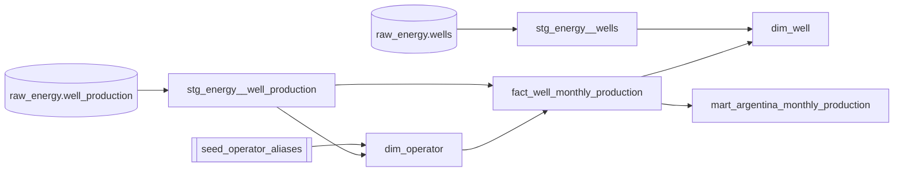

# dbt — transformación de datos

**Alcance:** cómo está organizado el proyecto dbt (`dbt/`), qué hace cada capa, cómo se testea y cómo se ejecuta.

dbt (`dbt-core` + adaptador `dbt-clickhouse`) toma las tablas raw cargadas por el pipeline de ingesta y las convierte, con SQL versionado y testeado, en las tablas que consume el exporter. No hay lógica de negocio en Python más allá de la carga: todo el modelado vive en `dbt/models/`.

## Por qué dbt

- El SQL de transformación queda versionado, revisable en PR y documentado junto al dato que produce.
- Los tests (`unique`, `not_null`, tests singulares en SQL) corren antes de exportar y bloquean una publicación con datos rotos.
- El grafo de dependencias (`ref()`) elimina el orden manual: dbt calcula qué modelo corre antes de cuál.
- `dbt-clickhouse` es maduro para este caso: agregaciones columnares sobre ~18M filas en segundos.

## Estructura del proyecto

```text
dbt/
├── dbt_project.yml       # config: paths, materializaciones por carpeta, vars
├── profiles.yml          # conexión a ClickHouse (target "local")
├── models/
│   ├── staging/          # 1:1 con raw, tipado y limpieza — vistas
│   ├── core/              # dimensiones y hechos — tablas
│   ├── marts/              # agregados listos para el exporter — tablas
│   └── schema.yml         # tests declarativos de todas las capas
├── seeds/
│   └── seed_operator_aliases.csv
├── tests/                 # tests singulares (SQL que debe devolver 0 filas)
└── macros/
    └── utils.sql          # slugify(), pvm_cutoff_date()
```

`profiles.yml` no tiene secretos: apunta a `127.0.0.1:9000` con las credenciales de desarrollo definidas en `docker-compose.yml`. `dbt_project.yml` fija dos variables globales usadas en varios modelos:

| Var | Valor | Uso |
|---|---|---|
| `pvm_cutoff` | `2026-07-31` | Corte de "mes completo" — ver `is_complete` en el mart. |
| `pvm_min_year` | `2006` | Primer año con datos de producción. |

## Las tres capas

| Capa | Materialización | Qué hace | Modelos actuales |
|---|---|---|---|
| **staging** | `view` | Tipa columnas raw (todo `String` en origen), normaliza vacíos a `''`/`NULL`, deriva `month_date`, pasa formación/tipo de recurso a minúsculas. Sin joins entre fuentes. | `stg_energy__well_production`, `stg_energy__wells` |
| **core** | `table` | Dimensiones y hechos reutilizables entre marts. Aquí vive la resolución de operador canónico y el join con el seed de aliases. | `dim_date_month`, `dim_operator`, `dim_well`, `fact_well_monthly_production` |
| **marts** | `table` | Agregados con la forma exacta que necesita una vista del frontend. El exporter solo lee de acá (nunca del fact crudo). | `mart_argentina_monthly_production` |

Staging es `view` porque no vale la pena materializar una limpieza de columnas sobre datos que ya están en ClickHouse (columnar, agrega rápido). Core y marts son `table` porque tienen joins/agregaciones más pesadas y se leen muchas veces en la misma corrida de export.

### Lineage actual



`dim_date_month` es independiente (genera un calendario 2006→corte) y hoy no se usa en el mart, pero queda disponible para joins de completitud de serie.

## Decisiones de modelado a destacar

**Resolución de operador canónico** (`dim_operator.sql`): hace `LEFT JOIN` contra el seed de aliases *solo* cuando `review_status = 'approved'`; si no matchea, `operator_canonical` cae al nombre raw y `review_status` se marca `pending_review`. Esto evita que una fila sin alias aprobado quede sin operador — nunca se pierde una fila, pero queda visible en `/calidad` cuántos operadores no están normalizados todavía.

**Idempotencia del hecho mensual** (`fact_well_monthly_production.sql`): usa `ReplacingMergeTree(_record_version)` con `ORDER BY (well_id, month_date)`. Si se reprocesa un mes (revisión de la fuente), la fila nueva con `_record_version` más alto reemplaza a la vieja en el mismo `(well_id, month_date)` sin duplicar — la clave de negocio del modelo de datos.

**Regla de mes completo** (`mart_argentina_monthly_production.sql`): `is_complete` no es "existe el mes", es `month_date <= pvm_cutoff` *y* no es el mes más reciente visto salvo que ese mes también esté antes del corte. Esto impide mostrar un mes parcial como si fuera un cierre.

## Tests

### Declarativos (`schema.yml`)

`unique`, `not_null` y `accepted_values` sobre columnas puntuales — por ejemplo `dim_well.well_id` es `unique`+`not_null`, y `seed_operator_aliases.review_status` solo acepta `approved`/`pending_review`.

### Singulares (`tests/*.sql`)

SQL libre que debe devolver **cero filas** para pasar:

| Test | Qué valida |
|---|---|
| `unique_stg_well_monthly.sql` | Sin `(well_id, month_date)` duplicado en staging, antes de que llegue al fact. |
| `unique_fact_well_monthly.sql` | Lo mismo, después del join con `dim_operator` (detecta si el join infla filas). |
| `plausible_monthly_series.sql` | Ningún mes de la serie nacional tiene petróleo, gas o pozos productivos `<= 0`. |

Los tres son de severidad bloqueante: si fallan, `make dbt-test` devuelve código de error y `make release` se corta antes de exportar.

## Macros

```sql

lower(replaceRegexpAll(trim(both '-' from replaceRegexpAll(trim(lower({{ expr }})), '[^a-z0-9]+', '-')), '-+', '-'))

```

Genera `operator_slug` (URL-safe) desde `operator_raw` — usado en `dim_operator` y en las rutas `/operadoras/:slug` del frontend.

```sql

toDate({{ "'" ~ var('pvm_cutoff') ~ "'" }})

```

Envuelve la variable `pvm_cutoff` como `Date` de ClickHouse — se usa en vez de repetir `toDate('2026-07-31')` en cada modelo que necesita la regla de cierre.

## Comandos

```bash
# desde la raíz del repo (el Makefile ya arma --project-dir/--profiles-dir)
make dbt                              # dbt run (todos los modelos)
make dbt ARGS="--select dim_well"     # dbt run de un modelo puntual
make dbt-test                         # dbt test (bloqueante)

# equivalente directo, si no querés pasar por el Makefile
cd pipeline && uv run dbt run --project-dir ../dbt --profiles-dir ../dbt
cd pipeline && uv run dbt seed --project-dir ../dbt --profiles-dir ../dbt   # cargar/actualizar seeds
cd pipeline && uv run dbt docs generate --project-dir ../dbt --profiles-dir ../dbt  # lineage navegable
```

`make release` encadena `dbt run` y `dbt test` limitados a `stg_ core. marts.` antes de exportar (ver `docs/actualizacion-datos.md`).

## Cómo agregar un modelo nuevo

1. Crear el `.sql` en `staging/`, `core/` o `marts/` según qué tan crudo/agregado sea.
2. Referenciar solo con `{{ ref('...') }}` — nunca un nombre de tabla hardcodeado, para que dbt arme el DAG bien.
3. Agregar tests mínimos en `schema.yml` (`not_null` en claves, `unique` en el grano declarado).
4. Si el modelo alimenta el exporter, agregar el query correspondiente en `pipeline/src/pvm/export.py` — dbt no le habla al frontend directamente, solo al exporter.
5. Correr `make dbt && make dbt-test` antes de commitear.

## Ver también

- [`clickhouse.md`](clickhouse.md) — motor sobre el que corre todo este SQL.
- [`MODELO_DE_DATOS.md`](MODELO_DE_DATOS.md) — catálogo de fuentes y diseño lógico completo (incluye los marts/dimensiones de Fase 2 que todavía no están construidos).
- [`actualizacion-datos.md`](actualizacion-datos.md) — dónde encaja `dbt run`/`dbt test` en el ciclo de release.
